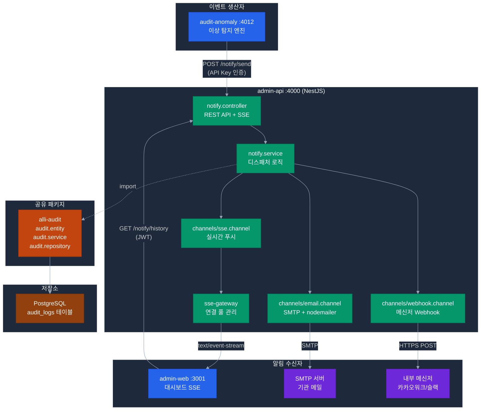

# 알림 모듈 설계 문서 (admin-api notify 모듈)

> **모듈 위치**: `apps/admin-api/src/module/notify/` (NestJS 모듈)
> **호스팅**: admin-api (:4000)
> **우선순위**: P1
> **역할**: 실시간 알림(SSE) + 이메일/메신저 발송
> **작성일**: 2026-04-21

---

## 1. 개요

admin-api 내부의 알림 처리 모듈. `audit-anomaly`가 RED 등급 이상 탐지 시 호출하여 SSE·이메일·메신저 다채널로 즉시 발송하고, 이력을 `alli-audit` 엔티티로 저장한다.

### 역할 및 책임

- `audit-anomaly` (:4012)가 RED 등급 이상 탐지 시 즉시 알림 발송
- admin-web 사용자에게 SSE로 실시간 푸시
- SMTP 이메일 비동기 발송
- 내부 메신저(카카오워크/슬랙/Teams 등) Webhook 발송
- 알림 이력 저장 및 읽음 처리 (`alli-audit` 엔티티 확장)

---

## 2. 시스템 구성



---

## 3. 모듈 구조

```
apps/admin-api/src/module/notify/
├── notify.controller.ts              # REST API + SSE 엔드포인트
├── notify.service.ts                 # 핵심 디스패처 로직
├── notify.module.ts                  # NestJS 모듈
├── dto/
│   ├── send-notification.dto.ts      # POST /notify/send 요청
│   └── notification-query.dto.ts     # GET /notify/history 쿼리
├── channels/
│   ├── channel.interface.ts          # 공통 채널 인터페이스
│   ├── email.channel.ts              # SMTP 발송 (nodemailer)
│   ├── webhook.channel.ts            # Webhook 발송 (axios)
│   └── sse.channel.ts                # SSE 스트리밍
├── sse-gateway.ts                    # SSE 연결 풀 관리
├── templates/
│   ├── audit-anomaly-red.hbs         # 이메일 템플릿 (Handlebars)
│   ├── audit-anomaly-orange.hbs
│   └── base.hbs                      # 공통 레이아웃
└── formatters/
    ├── kakaowork.formatter.ts        # 카카오워크 Block Kit
    ├── slack.formatter.ts            # Slack Incoming Webhook
    └── teams.formatter.ts            # MS Teams Adaptive Card
```

---

## 4. REST API 명세

| Method | 경로 | 설명 | 인증 |
|--------|------|------|:----:|
| `POST` | `/notify/send` | 알림 발송 (audit-anomaly 호출용) | API Key |
| `GET` | `/notify/stream` | SSE 실시간 스트림 | JWT |
| `GET` | `/notify/history` | 알림 이력 조회 | JWT |
| `GET` | `/notify/unread-count` | 미읽음 개수 | JWT |
| `PATCH` | `/notify/:id/read` | 단건 읽음 처리 | JWT |
| `POST` | `/notify/read-all` | 전체 읽음 처리 | JWT |

### 4.1 알림 발송 요청 (내부 API)

```typescript
// POST /notify/send
// X-API-Key: {INTERNAL_API_KEY}

interface SendNotificationDto {
  tenantId: string;
  category: 'audit_anomaly' | 'manual' | 'system';
  severity: 'RED' | 'ORANGE' | 'YELLOW' | 'GREEN';
  title: string;
  body: string;
  payload?: {
    ruleCode?: string;
    deptCode?: string;
    riskScore?: number;
    anomalyId?: string;
  };
  targets: {
    sse?: boolean;
    email?: string[];       // 수신 이메일 주소 배열
    webhook?: string[];     // 'kakaowork' | 'slack' | 'teams'
  };
}
```

### 4.2 심각도별 발송 정책

| 등급 | SSE | 이메일 | Webhook | 팝업 강제 |
|------|:---:|:-----:|:------:|:--------:|
| **RED** | ✅ | ✅ | ✅ | ✅ |
| **ORANGE** | ✅ | ✅ | — | — |
| **YELLOW** | ✅ | — | — | — |
| **GREEN** | 이력만 저장 | — | — | — |

---

## 5. 핵심 구현

### 5.1 NotifyService

```typescript
// notify.service.ts
import { Injectable } from '@nestjs/common';
import { AuditService } from '@alli/audit';
import { EmailChannel } from './channels/email.channel';
import { WebhookChannel } from './channels/webhook.channel';
import { SseChannel } from './channels/sse.channel';

@Injectable()
export class NotifyService {
  constructor(
    private readonly auditService: AuditService,
    private readonly emailChannel: EmailChannel,
    private readonly webhookChannel: WebhookChannel,
    private readonly sseChannel: SseChannel,
  ) {}

  async sendNotification(dto: SendNotificationDto): Promise<void> {
    // 1. 이력 저장
    const auditLog = await this.auditService.create({
      tenantId: dto.tenantId,
      category: dto.category,
      severity: dto.severity,
      title: dto.title,
      body: dto.body,
      payload: dto.payload,
    });

    // 2. 병렬 발송 (실패해도 다른 채널은 시도)
    const tasks: Promise<void>[] = [];

    if (dto.targets.sse) {
      tasks.push(this.sseChannel.push(dto.tenantId, auditLog));
    }
    if (dto.targets.email?.length) {
      tasks.push(this.emailChannel.send(dto.targets.email, auditLog));
    }
    if (dto.targets.webhook?.length) {
      tasks.push(this.webhookChannel.dispatch(dto.targets.webhook, auditLog));
    }

    await Promise.allSettled(tasks);
  }
}
```

### 5.2 SSE 게이트웨이

```typescript
// sse-gateway.ts
import { Injectable } from '@nestjs/common';
import { Subject } from 'rxjs';

@Injectable()
export class SseGateway {
  private readonly subjects = new Map<string, Subject<MessageEvent>>();

  subscribe(tenantId: string) {
    if (!this.subjects.has(tenantId)) {
      this.subjects.set(tenantId, new Subject());
    }
    return this.subjects.get(tenantId)!.asObservable();
  }

  push(tenantId: string, event: AuditLogEntity) {
    const subject = this.subjects.get(tenantId);
    subject?.next({
      type: event.category,
      data: JSON.stringify({
        eventId: event.id,
        severity: event.severity,
        title: event.title,
        body: event.body,
        payload: event.payload,
        createdAt: event.createdAt,
      }),
    } as MessageEvent);
  }
}
```

### 5.3 SSE 컨트롤러

```typescript
// notify.controller.ts
import { Controller, Sse, MessageEvent, UseGuards } from '@nestjs/common';
import { Observable } from 'rxjs';
import { JwtAuthGuard } from '@alli/auth';

@Controller('notify')
@UseGuards(JwtAuthGuard)
export class NotifyController {
  constructor(private readonly sseGateway: SseGateway) {}

  @Sse('stream')
  stream(@Req() req: AuthRequest): Observable<MessageEvent> {
    return this.sseGateway.subscribe(req.user.tenantId);
  }
}
```

---

## 6. 이메일 발송

### 6.1 구현 (nodemailer)

```typescript
// channels/email.channel.ts
import { Injectable } from '@nestjs/common';
import * as nodemailer from 'nodemailer';
import * as Handlebars from 'handlebars';
import * as fs from 'fs/promises';

@Injectable()
export class EmailChannel {
  private transporter: nodemailer.Transporter;

  constructor(private readonly config: ConfigService) {
    this.transporter = nodemailer.createTransport({
      host: this.config.get('SMTP_HOST'),
      port: this.config.get('SMTP_PORT'),
      secure: this.config.get('SMTP_TLS'),
      auth: {
        user: this.config.get('SMTP_USER'),
        pass: this.config.get('SMTP_PASSWORD'),
      },
    });
  }

  async send(recipients: string[], event: AuditLogEntity): Promise<void> {
    const template = await this.loadTemplate(event.category, event.severity);
    const html = template(event);

    await this.transporter.sendMail({
      from: this.config.get('SMTP_FROM'),
      to: recipients.join(', '),
      subject: `[${event.severity}] ${event.title}`,
      html,
    });
  }

  private async loadTemplate(category: string, severity: string) {
    const path = `templates/${category}-${severity.toLowerCase()}.hbs`;
    const source = await fs.readFile(path, 'utf-8');
    return Handlebars.compile(source);
  }
}
```

### 6.2 템플릿 예시

```handlebars
<!-- templates/audit-anomaly-red.hbs -->
<!DOCTYPE html>
<html>
<body style="font-family: Arial, sans-serif;">
  <div style="background: #dc2626; color: white; padding: 16px; text-align: center;">
    <h1>🚨 긴급: 감사 이상 탐지</h1>
  </div>
  <div style="padding: 24px;">
    <h2>{{title}}</h2>
    <p>{{body}}</p>
    <table style="width: 100%; border-collapse: collapse;">
      <tr><td><b>탐지 규칙</b></td><td>{{payload.ruleCode}}</td></tr>
      <tr><td><b>부서</b></td><td>{{payload.deptCode}}</td></tr>
      <tr><td><b>리스크 점수</b></td><td>{{payload.riskScore}}</td></tr>
    </table>
    <a href="{{adminWebUrl}}/activities/audits/{{payload.anomalyId}}"
       style="display: inline-block; background: #1d4ed8; color: white;
              padding: 12px 24px; text-decoration: none; border-radius: 4px;">
      상세보기
    </a>
  </div>
</body>
</html>
```

---

## 7. Webhook 메신저 발송

### 7.1 지원 메신저

| 메신저 | 포맷터 | 비고 |
|--------|--------|------|
| 카카오워크 | Block Kit | Incoming Webhook |
| 슬랙 | Slack Blocks | Incoming Webhook |
| MS Teams | Adaptive Card | Connector |
| 잔디 | JANDI Message | Incoming Webhook |
| 커스텀 HTTP | Generic JSON | 공통 POST |

### 7.2 구현

```typescript
// channels/webhook.channel.ts
import { Injectable } from '@nestjs/common';
import { HttpService } from '@nestjs/axios';

@Injectable()
export class WebhookChannel {
  private readonly formatters = new Map<string, WebhookFormatter>([
    ['kakaowork', new KakaoworkFormatter()],
    ['slack', new SlackFormatter()],
    ['teams', new TeamsFormatter()],
  ]);

  constructor(private readonly http: HttpService) {}

  async dispatch(targets: string[], event: AuditLogEntity): Promise<void> {
    await Promise.allSettled(
      targets.map(async (target) => {
        const formatter = this.formatters.get(target);
        const webhookUrl = await this.resolveWebhookUrl(target, event.tenantId);
        if (!formatter || !webhookUrl) return;

        const payload = formatter.format(event);
        await this.http.axiosRef.post(webhookUrl, payload, { timeout: 10_000 });
      }),
    );
  }
}
```

---

## 8. 이력 저장 (alli-audit)

### 8.1 엔티티

```typescript
// packages/alli-audit/src/audit.entity.ts

@Entity('audit_logs')
export class AuditLogEntity {
  @PrimaryGeneratedColumn('uuid') id: string;
  @Column() tenantId: string;
  @Column() category: string;           // 'audit_anomaly', 'manual', 'system'
  @Column() severity: string;           // RED/ORANGE/YELLOW/GREEN
  @Column() title: string;
  @Column('text') body: string;
  @Column('jsonb') payload: object;
  @Column('jsonb') targets: object;
  @CreateDateColumn() createdAt: Date;

  @OneToMany(() => AuditReceiptEntity, (r) => r.auditLog)
  receipts: AuditReceiptEntity[];
}

// 수신자별 읽음 상태
@Entity('audit_receipts')
export class AuditReceiptEntity {
  @PrimaryGeneratedColumn('uuid') id: string;
  @ManyToOne(() => AuditLogEntity) auditLog: AuditLogEntity;
  @Column() tenantId: string;
  @Column() empCd: string;
  @Column({ default: false }) isRead: boolean;
  @Column({ nullable: true }) readAt: Date;
  @Column() channel: string;            // sse, email, webhook
  @Column({ nullable: true }) sentAt: Date;
  @Column({ default: 'pending' }) sendStatus: string;  // pending, sent, failed
  @CreateDateColumn() createdAt: Date;
}
```

### 8.2 조회 쿼리

```typescript
// 미읽음 알림 목록
async findUnread(tenantId: string, empCd: string, limit = 20) {
  return this.auditLogRepo
    .createQueryBuilder('log')
    .innerJoin('log.receipts', 'r')
    .where('log.tenantId = :tenantId', { tenantId })
    .andWhere('r.empCd = :empCd', { empCd })
    .andWhere('r.isRead = false')
    .orderBy('log.createdAt', 'DESC')
    .limit(limit)
    .getMany();
}
```

---

## 9. 환경 변수 (admin-api)

```env
# SMTP 이메일 발송
SMTP_HOST=mail.agency.go.kr
SMTP_PORT=587
SMTP_TLS=true
SMTP_USER=noreply@agency.go.kr
SMTP_PASSWORD=<password>
SMTP_FROM=alli-system@agency.go.kr

# Webhook 기본 URL (테넌트별 DB에서 오버라이드 가능)
DEFAULT_WEBHOOK_KAKAOWORK=https://hook.kakaowork.com/...
DEFAULT_WEBHOOK_SLACK=https://hooks.slack.com/...

# 내부 API 인증 (audit-anomaly 등이 호출)
INTERNAL_API_KEY=<shared-internal-key>

# admin-web URL (Webhook 딥링크 생성용)
ADMIN_WEB_URL=http://admin-web:3001
```

---

## 10. 외부 시스템 연동

| 시스템 | 연동 방식 | 용도 |
|--------|----------|------|
| **audit-anomaly** (:4012) | HTTP POST | 알림 발송 요청 |
| **SMTP 서버** | SMTP/TLS | 이메일 발송 |
| **카카오워크** | HTTPS Webhook | 메신저 알림 |
| **슬랙** | HTTPS Webhook | 메신저 알림 |
| **MS Teams** | HTTPS Webhook | 메신저 알림 |
| **admin-web** | SSE (브라우저) | 실시간 UI 알림 |
| **PostgreSQL** | TypeORM | 이력 저장 (alli-audit) |

---

## 11. 필요 데이터 및 문서

### 11.1 고객 사전 제공 필요

| # | 항목 | 제공 주체 | 필요 시점 |
|---|------|----------|---------|
| 1 | SMTP 서버 접속 정보 | 전산망 담당자 | Phase 1 초 |
| 2 | 메신저 Webhook URL | 정보시스템 담당자 | Phase 2 |
| 3 | 알림 수신자 목록 (감사팀 이메일) | 감사팀 | Phase 3 |
| 4 | 기관 이메일 서명/로고 | 홍보팀 | Phase 3 |
| 5 | 알림 문구 검토·승인 | 감사팀/관리자 | Phase 3 |

**관련 고객 결정 포인트**: [D9-07 메신저 Webhook](../challenges/15-per-challenge-decision-points.md#-과제-9--사전-알림--감사-리스크-대시보드), [D9-08 SMTP 서버](../challenges/15-per-challenge-decision-points.md#-과제-9--사전-알림--감사-리스크-대시보드)

---

## 12. 비기능 요건

| 항목 | 목표 |
|------|------|
| SSE 연결 지연 | RED 탐지 후 ≤3초 |
| 이메일 발송 지연 | RED 탐지 후 ≤30초 |
| 동시 SSE 연결 | 최대 200개 |
| 메시지 손실 | alli-audit에 pending 저장 후 재시도 |
| SSE 재연결 | 클라이언트 자동 ≤5초 |
| 가용성 | 99.5% (POC 기준) |

---

## 13. 구현 범위 (우선순위)

### P0 — 반드시 구현

- [ ] notify.controller + notify.service + notify.module
- [ ] SSE 스트리밍
- [ ] audit-anomaly 연동 (POST /notify/send)
- [ ] alli-audit 엔티티 확장 및 저장
- [ ] admin-web 알림 벨 아이콘 SSE 연동

### P1 — 구현 권장

- [ ] SMTP 이메일 발송 (nodemailer + Handlebars 템플릿)
- [ ] 카카오워크 Webhook
- [ ] 읽음 처리 API

### P2 — 시간 여유 시

- [ ] 슬랙/Teams Webhook
- [ ] 채널 관리자 설정 UI
- [ ] 재시도 로직 (exponential backoff)

---

## 14. 관련 문서

- [09-alert-dashboard.md](../challenges/09-alert-dashboard.md) — 관련 과제 9
- [audit-anomaly.md](audit-anomaly.md) — 알림 이벤트 생산자
- [../improvements/admin-api.md](../improvements/admin-api.md) — admin-api 개선 태스크
- [12-optimized-architecture.md](../challenges/12-optimized-architecture.md) — 전체 아키텍처
