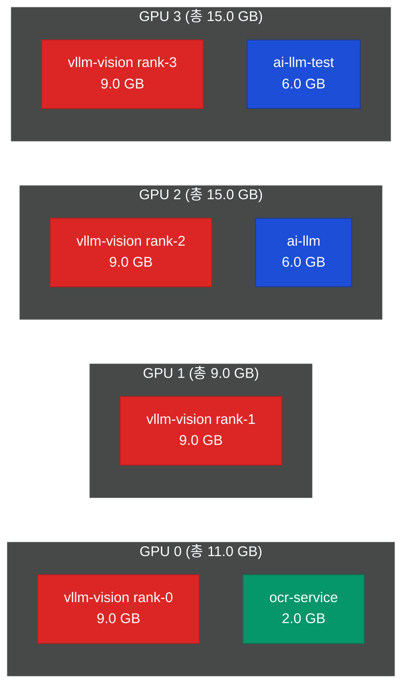

# ai-llm 서비스 개선 태스크 (POC 대응)

> **서비스**: `projects/20_alli-llm/app/`
> **기술**: vLLM + HuggingFace 모델 + FastAPI + PaddleOCR
> **POC 역할**: LLM 추론 엔진 (POC 1, 2, 3 공통) — 한국어 행정 문서 특화
> **작성일**: 2026-04-21
> **기준 설정**: `docker-compose.prod.yaml` + `.env.prod` 실제 운영 구성

> **📌 POC 확장 범위 요약**
> 기존 Gemma-4 31B AWQ (TP=4) + PP-OCRv5 + BGE-M3 스택 유지.
> 핵심 작업: **행정 규정 특화 프롬프트 4종 추가** (결재 기안 / 규정 Q&A / 문서 적합성 / 감사 설명).

---

## 1. 현재 운영 구성

### 1.1 서비스 포트 및 GPU 할당

| 서비스 | 포트 | 컨테이너 | GPU | VRAM 사용 |
|--------|:---:|---------|:---:|:--------:|
| **ai-llm** (FastAPI 게이트웨이, 운영) | 6001 | alli-ai-llm | GPU 2 | ~6 GB (fraction=0.30) |
| **ai-llm-test** (FastAPI, 테스트) | 6002 | alli-ai-llm-test | GPU 3 | ~6 GB (fraction=0.30) |
| **Gradio UI** | 6003 | alli-ai-gradio | — | — |
| **vllm-vision** (Gemma-4 31B AWQ) | 6012 | alli-ai-vllm-vision | GPU 0~3 (TP=4) | ~37.8 GB 전체 (GPU당 9.4GB) |
| **ocr-service** (PP-OCRv5 korean) | 6014 | alli-ai-ocr-service | GPU 0 (fraction=0.15) | ~2 GB |
| **Redis** | 6031 | alli-ai-redis | — | — |

> **⚠️ 중요 — 포트 통합**: `.env.prod` 기준 `coder`, `chat`, `vision` 3가지 모델명이 모두 동일한 vllm-vision 엔드포인트로 라우팅됨.
> ```env
> AI_LLM_LLM_CHAT_URL=http://vllm-vision:8000
> AI_LLM_LLM_CODER_URL=http://vllm-vision:8000
> AI_LLM_LLM_VISION_URL=http://vllm-vision:8000
> ```

### 1.2 사용 중인 모델 목록

| 역할 | 모델 | 양자화 | VRAM | 라이선스 | 호스트 |
|------|------|:-----:|:----:|---------|-------|
| Chat/Coder/Vision 통합 | **gemma-4-31B-it-AWQ** | AWQ INT4 | 20 GB (TP=4 분산) | Apache 2.0 | vllm-vision |
| 텍스트 임베딩 | **BGE-M3** | FP16 | ~2.3 GB | MIT | ai-llm (sentence-transformers) |
| 재순위 (Rerank) | **bge-reranker-v2-m3** | FP16 | ~2 GB | Apache 2.0 | ai-llm (sentence-transformers) |
| OCR (한국어 문서) | **PP-OCRv5 korean mobile** | INT8 | ~2 GB | Apache 2.0 | ocr-service |

> 🟢 **모든 모델 Apache 2.0 / MIT 라이선스** — 비용·라이선스 협의 불필요, 내부망 완전 적용 가능

---

## 2. Gemma-4 31B-it-AWQ 상세 및 GPU VRAM 재산정

### 2.1 모델 사양

| 항목 | 값 | 설명 |
|------|---|------|
| **Parameters** | 31B | 30.7B active / 33B total |
| **Layers** | 62 | Transformer 디코더 레이어 |
| **Attention heads (Q)** | 32 | Multi-head attention |
| **KV heads (GQA)** | 16 | Grouped Query Attention, TP=4로 분산 시 rank당 4 heads |
| **Head dim** | 160 | Per head |
| **Max context length** | 128K | 모델 스펙 (운영 시 16K로 제한) |
| **Vocab size** | 256,000 | Gemma 토크나이저 |
| **양자화** | **AWQ INT4** | Activation-aware Weight Quantization, 4-bit 가중치 |
| **라이선스** | Apache 2.0 | 비용 없음, 내부망 적용 가능 |

### 2.2 VRAM 구성 요소별 재산정 (토큰 기반)

vLLM 실행 시 VRAM은 3가지로 구성:

#### (1) 모델 가중치 (Static, TP=4)

```
전체 가중치 (AWQ INT4):
  31B × 0.5 byte + AWQ metadata/scales ≈ 20 GB

TP=4 분산 (Tensor Parallel):
  20 GB ÷ 4 = 5 GB per GPU
```

#### (2) KV Cache (Dynamic, context length 기반)

**KV Cache 공식**:
```
KV Cache per token (bytes)
  = 2 (K, V) × num_layers × num_kv_heads × head_dim × dtype_bytes
  = 2 × 62 × 16 × 160 × 2 bytes (BF16 activation)
  = 634,880 bytes
  ≈ 620 KB/token
```

**Context Length별 KV Cache 요구량**:

| Context (tokens) | 전체 KV Cache | **TP=4 per GPU** |
|:--------------:|:-----------:|:---------------:|
| 4K (4,096) | 2.54 GB | **0.64 GB** |
| 8K (8,192) | 5.08 GB | **1.27 GB** |
| **16K (16,384) ⭐ 현재 운영** | **10.17 GB** | **2.54 GB** |
| 32K (32,768) | 20.34 GB | **5.08 GB** |
| 64K (65,536) | 40.67 GB | **10.17 GB** |
| 128K (131,072) | 81.34 GB | **20.34 GB** (고용량 GPU 필수) |

**배치 처리** (현재 설정: `max_num_batched_tokens=16384`):
```
KV Cache 사용량 = batch_total_tokens × 620 KB
  - 1명 × 16K context   = 10.17 GB (TP4: 2.54 GB/GPU)
  - 4명 × 4K context    = 10.17 GB (TP4: 2.54 GB/GPU)
  - 16명 × 1K context   = 10.17 GB (TP4: 2.54 GB/GPU)

※ 동시 사용자 수가 아니라 "총 배치 토큰 수"가 KV Cache 상한 결정
```

#### (3) Activation + Workspace (Static, 연산 중)

```
Activation 메모리 (per GPU, TP=4):
  - forward pass tensors: ~800 MB
  - FlashAttention workspace: ~400 MB
  - CUDA context + PyTorch 기본: ~400 MB
  합계: ~1.5 GB/GPU
```

### 2.3 vllm-vision VRAM 합계 (per GPU, TP=4)

| Context | 가중치 | KV Cache | Activation | **합계** | vLLM 예약 (util=0.68) |
|:-------:|:-----:|:--------:|:---------:|:-------:|:-------------------:|
| 4K | 5.00 GB | 0.64 GB | 1.50 GB | **7.14 GB** | 13.6 GB (20GB GPU 기준) |
| 8K | 5.00 GB | 1.27 GB | 1.50 GB | **7.77 GB** | 13.6 GB |
| **16K ⭐** | **5.00 GB** | **2.54 GB** | **1.50 GB** | **9.04 GB** | **13.6 GB (여유 4.5 GB)** |
| 32K | 5.00 GB | 5.08 GB | 1.50 GB | **11.58 GB** | 13.6 GB (여유 2 GB, **불안정**) |
| 64K | 5.00 GB | 10.17 GB | 1.50 GB | **16.67 GB** | 20GB GPU 불가 |

### 2.4 실제 운영 설정 (docker-compose.prod.yaml)

```yaml
vllm-vision:
  image: harbor.allsharp.co.kr/alli-llm/vllm-gemma4:v0.19.0
  command:
    - vllm serve $VLLM_VISION_MODEL \
      --served-model-name coder chat vision \        # 3가지 이름 모두 이 모델로
      --tensor-parallel-size 4 \                      # TP=4
      --gpu-memory-utilization 0.68 \                 # GPU 2/3에 ai-llm 공존
      --max-model-len 16384 \                         # 16K context
      --max-num-batched-tokens 16384 \                # batch 상한
      --dtype bfloat16 \                              # BF16 activation (AWQ 가중치)
      --limit-mm-per-prompt '{"image":2}' \           # 이미지 최대 2장
      --enforce-eager                                 # CUDA graph 비활성 (안정성)
  deploy:
    resources:
      reservations:
        devices:
          - device_ids: ['0', '1', '2', '3']
```

> **`gpu_memory_util=0.68` 인하 이유**: GPU 2/3에 `ai-llm` 컨테이너가 embedding/rerank 용도로 공존하여 vLLM이 독점 불가. OOM 방지.

---

## 3. 보조 모델 VRAM 상세

### 3.1 BGE-M3 + bge-reranker-v2-m3 (ai-llm 컨테이너)

```
BGE-M3 (임베딩, 568M 파라미터):
  모델 가중치 (FP16):       1.14 GB
  최대 batch=64 시 추가:   ~1.8 GB
  합계:                     ~3 GB (순수 임베딩 요청)

bge-reranker-v2-m3 (568M 파라미터):
  모델 가중치 (FP16):       1.14 GB
  최대 batch=32 시 추가:   ~1.3 GB
  합계:                     ~2.5 GB

PyTorch CUDA context:        ~0.5 GB

ai-llm 컨테이너 VRAM 합계:   ~6 GB (fraction=0.30 × 20GB = 6GB)
```

> **ai-llm-test**는 동일 구성을 GPU 3에서 운영 (운영 트래픽과 테스트 분리)

### 3.2 PP-OCRv5 korean mobile (ocr-service)

```
PP-OCRv5 mobile (경량 버전):
  Detection 모델:           0.3 GB
  Recognition 모델:         0.4 GB
  Layout 모델:              0.1 GB
  PaddlePaddle 초기화:      0.8 GB
  Activation (4096×4096):  ~0.4 GB
  합계:                     ~2 GB (fraction=0.15 × 20GB = 3GB 예약)
```

> 2026-04-16 이전에는 **PaddleOCR-VL 1.5** (~5.9 GB) 사용했으나 vLLM TP=4와 GPU 공존 위해 경량 모델로 전환.

---

## 4. GPU별 최종 VRAM 할당 (현재 운영)



### 4.1 GPU별 사용량 (16K context, 현재 운영 기준)

| GPU | vllm-vision | ocr-service | ai-llm/test | **합계** | 20GB GPU 여유 | 24GB GPU 여유 | 48GB GPU 여유 |
|:---:|:---------:|:---------:|:---------:|:-------:|:----------:|:----------:|:----------:|
| GPU 0 | 9.0 GB | 2.0 GB | — | **11.0 GB** | 9 GB (45%) | 13 GB (54%) | 37 GB (77%) |
| GPU 1 | 9.0 GB | — | — | **9.0 GB** | 11 GB (55%) | 15 GB (63%) | 39 GB (81%) |
| GPU 2 | 9.0 GB | — | 6.0 GB | **15.0 GB** | 5 GB (25%) ⚠️ | 9 GB (38%) | 33 GB (69%) |
| GPU 3 | 9.0 GB | — | 6.0 GB | **15.0 GB** | 5 GB (25%) ⚠️ | 9 GB (38%) | 33 GB (69%) |

> **⚠️ 20 GB GPU에서 GPU 2/3 여유 25% (5GB)** — OOM 위험. 24GB GPU 이상 권장.

### 4.2 Context Length 확장 시 VRAM (vllm-vision only, per GPU)

| Context | GPU 0 | GPU 1 | GPU 2 | GPU 3 | 필요 GPU VRAM |
|:-------:|:-----:|:-----:|:-----:|:-----:|:-----------:|
| 4K | 9.1 | 7.1 | 13.1 | 13.1 | ≥ 20 GB |
| **16K (현재)** | **11.0** | **9.0** | **15.0** | **15.0** | **≥ 24 GB** |
| 32K | 13.6 | 11.6 | 17.6 | 17.6 | ≥ 32 GB |
| 64K | 18.7 | 16.7 | 22.7 | 22.7 | ≥ 32 GB (OOM 위험) |
| 128K | 28.8 | 26.8 | 32.8 | 32.8 | ≥ 48 GB |

**→ 권장 GPU VRAM**:
- **최소 24 GB × 4** — 16K context 유지
- **권장 48 GB × 4** (L40S / A40) — 32K context 안정 + 향후 확장 대비

---

## 5. 개선 태스크

### TASK-LLM-01 한국어 행정 규정 특화 시스템 프롬프트 라이브러리

| 항목 | 내용 |
|------|------|
| **우선순위** | P0 (Q&A 품질 직결) |
| **예상 공수** | 2일 |
| **담당** | AI/ML 중급 |

```python
# app/src/ai_llm/prompts/admin_regulation_prompts.py

REGULATION_QA_SYSTEM = """당신은 대한민국 행정기관 규정 전문 AI 어시스턴트입니다.
인사·복무·회계·행정업무 규정에 대한 정확한 정보를 제공합니다.

[역할과 원칙]
1. 제공된 규정 조항에 근거하여 답변합니다
2. 규정에 없는 내용은 추측하지 않습니다
3. 불명확한 경우 담당 부서 확인을 권장합니다
4. 최신 개정 규정을 우선 적용합니다
5. 법령·훈령·예규·지침의 위계를 고려합니다

[답변 형식]
규정에 근거한 명확하고 간결한 답변을 제공합니다.
근거 조항은 "제X조(제목)" 형식으로 명시합니다.
예외 사항이 있는 경우 반드시 언급합니다.

※ 본 답변은 참고용이며, 공식 해석은 해당 부서에 문의하세요.
"""

REGULATION_QA_USER_TEMPLATE = """[관련 규정 조항]
{retrieved_contexts}

[질문]
{question}

[답변 형식]
1. **핵심 답변**: (질문에 대한 직접적인 답변 — 1~3문장)
2. **근거 규정**: (예: 복무규정 제X조(제목))
3. **추가 확인 사항**: (상황에 따라 다를 수 있는 내용, 없으면 생략)
4. **주의사항**: (예외나 제한 사항, 없으면 생략)

규정에 명시되지 않은 내용은 "규정에 명시되어 있지 않습니다. 해당 부서에 문의하세요."로 답변하세요.
"""

DOCUMENT_COMPLIANCE_SYSTEM = """당신은 대한민국 행정기관 문서 규정 준수 전문가입니다.
제출된 문서가 관련 규정·지침·서식을 준수하는지 검토합니다.

[검토 원칙]
1. 규정 위반 여부를 객관적으로 판단합니다
2. 위반 항목마다 근거 조항을 명시합니다
3. 수정 방법을 구체적으로 제시합니다
4. 규정 준수 점수는 0~100점으로 평가합니다
"""

APPROVAL_DRAFT_SYSTEM = """당신은 대한민국 행정기관 전자결재 기안 전문가입니다.
담당자의 요청에 따라 규정에 맞는 결재 기안서를 작성합니다.

[작성 원칙]
1. 해당 기관의 공문서 작성 규정을 준수합니다
2. 결재 경로는 직급 체계를 반영합니다
3. 금액은 정확히 표기하고 산출 근거를 포함합니다
4. 법령·규정 근거를 기안 내용에 명시합니다
"""

AUDIT_EXPLANATION_SYSTEM = """당신은 대한민국 행정기관 감사 전문가입니다.
AI가 탐지한 이상 패턴을 감사 담당자가 이해할 수 있도록 설명합니다.

[설명 원칙]
1. 이상 패턴의 구체적 근거(데이터)를 제시합니다
2. 위반 가능한 규정 조항을 명시합니다
3. 실제 위반인지, 합리적 사유가 있는지 구분합니다
4. 후속 조치를 구체적으로 권고합니다
5. 담당자가 이해할 수 있는 평이한 용어를 사용합니다
"""
```

---

### TASK-LLM-02 POC 전용 API 엔드포인트

| 항목 | 내용 |
|------|------|
| **우선순위** | P0 |
| **예상 공수** | 1일 |
| **담당** | AI/ML 중급 |

```python
# app/src/ai_llm/routers/v1/endpoints/poc.py

from fastapi import APIRouter
from src.ai_llm.prompts.admin_regulation_prompts import (
    REGULATION_QA_SYSTEM, REGULATION_QA_USER_TEMPLATE,
    DOCUMENT_COMPLIANCE_SYSTEM,
    APPROVAL_DRAFT_SYSTEM,
    AUDIT_EXPLANATION_SYSTEM,
)

router = APIRouter(prefix="/v1/poc")

@router.post("/regulation-qa")
async def regulation_qa(request: RegulationQARequest):
    """규정 Q&A — ai-rag 검색 조항 기반 답변 생성"""
    messages = [
        {"role": "system", "content": REGULATION_QA_SYSTEM},
        {"role": "user", "content": REGULATION_QA_USER_TEMPLATE.format(
            retrieved_contexts=request.retrieved_contexts,
            question=request.question,
        )}
    ]
    return await llm_client.chat_completions(
        model="coder",              # gemma-4-31B-it-AWQ로 라우팅
        messages=messages,
        max_tokens=800,
        temperature=0.1,
        stream=request.stream,
    )

@router.post("/compliance-check")
async def compliance_check(request: ComplianceCheckRequest):
    """문서 적합성 점검 — JSON 구조화 응답"""
    # ai-assistant compliance_graph에서 호출
    ...

@router.post("/approval-draft")
async def approval_draft(request: ApprovalDraftRequest):
    """전자결재 기안 초안 생성"""
    ...

@router.post("/audit-explanation")
async def audit_explanation(request: AuditExplanationRequest):
    """감사 이상 패턴 자연어 설명 생성"""
    ...
```

---

### TASK-LLM-03 임베딩 파이프라인 최적화 (BGE-M3)

| 항목 | 내용 |
|------|------|
| **우선순위** | P1 |
| **예상 공수** | 2일 |
| **담당** | AI/ML 상급 |

```python
# app/src/ai_llm/services/embedding_service.py

EMBEDDING_CONFIG = {
    "model": "BAAI/bge-m3",          # 현재 운영 모델
    "dim": 1024,                      # 임베딩 차원
    "max_seq_length": 8192,           # BGE-M3 지원 최대
    "batch_size": 64,                 # GPU 메모리 최적화
    "normalize_embeddings": True,     # 코사인 유사도
}

class AdminDocEmbedder:
    """행정 규정 문서 전용 임베딩 — BGE-M3 기반"""

    def preprocess_regulation_text(self, text: str) -> str:
        """한자어, 법령 약어, 특수문자 정규화"""
        text = text.replace('　', ' ')
        text = text.replace('①', '1. ').replace('②', '2. ')
        text = text.replace('③', '3. ').replace('④', '4. ')
        text = text.replace('⑤', '5. ')
        abbreviations = {
            '복무규': '복무규정',
            '회계규': '회계규정',
            '인사규': '인사규정',
        }
        for abbr, full in abbreviations.items():
            text = text.replace(abbr, full)
        return text.strip()

    async def embed_batch(self, texts: list[str]) -> list[list[float]]:
        """배치 임베딩 (GPU 효율화)"""
        preprocessed = [self.preprocess_regulation_text(t) for t in texts]
        return await embedding_model.encode(
            preprocessed,
            batch_size=EMBEDDING_CONFIG["batch_size"],
            normalize_embeddings=True,
        )
```

---

### TASK-LLM-04 LLM 성능·메모리 모니터링

| 항목 | 내용 |
|------|------|
| **우선순위** | P1 |
| **예상 공수** | 1일 |
| **담당** | AI/ML 중급 |

```python
# app/src/ai_llm/observability/poc_metrics.py

from prometheus_client import Counter, Histogram, Gauge

# 요청 메트릭
POC_REQUEST_COUNT = Counter('poc_llm_requests_total', '...', ['endpoint', 'status'])
POC_LATENCY = Histogram('poc_llm_latency_seconds', '...', ['endpoint'],
                        buckets=[0.5, 1.0, 2.0, 3.0, 5.0, 10.0, 30.0])
POC_TOKEN_USAGE = Counter('poc_llm_tokens_total', '...', ['endpoint', 'type'])

# GPU 메모리 모니터링
GPU_VRAM_USED = Gauge('gpu_vram_used_bytes', 'GPU VRAM used per device', ['gpu_id'])
GPU_VRAM_TOTAL = Gauge('gpu_vram_total_bytes', 'GPU VRAM total per device', ['gpu_id'])
GPU_UTIL = Gauge('gpu_utilization_pct', 'GPU utilization percent', ['gpu_id'])

# KV Cache 모니터링 (vLLM 메트릭 연동)
KV_CACHE_USAGE = Gauge('vllm_kv_cache_usage_bytes', 'KV cache in use')
KV_CACHE_HIT_RATE = Gauge('vllm_kv_cache_hit_rate', 'KV cache hit rate')

async def collect_gpu_metrics():
    """30초마다 nvidia-ml-py로 GPU 메트릭 수집"""
    import pynvml
    pynvml.nvmlInit()
    for i in range(pynvml.nvmlDeviceGetCount()):
        handle = pynvml.nvmlDeviceGetHandleByIndex(i)
        info = pynvml.nvmlDeviceGetMemoryInfo(handle)
        util = pynvml.nvmlDeviceGetUtilizationRates(handle)
        GPU_VRAM_USED.labels(gpu_id=str(i)).set(info.used)
        GPU_VRAM_TOTAL.labels(gpu_id=str(i)).set(info.total)
        GPU_UTIL.labels(gpu_id=str(i)).set(util.gpu)
```

---

### TASK-LLM-05 GPU 여유도 모니터링 및 알람

| 항목 | 내용 |
|------|------|
| **우선순위** | P0 (OOM 방지) |
| **예상 공수** | 1일 |
| **담당** | DevOps |

**Prometheus Alert 규칙**:
```yaml
# docker/monitoring/alerts.yml
groups:
  - name: gpu_vram_alerts
    rules:
      - alert: GPUVRAMHighUsage
        expr: (gpu_vram_used_bytes / gpu_vram_total_bytes) > 0.90
        for: 5m
        annotations:
          summary: "GPU {{ $labels.gpu_id }} VRAM 90% 초과"
          description: "현재 사용률: {{ $value }}% — OOM 위험"

      - alert: GPUOOMRisk
        expr: (gpu_vram_used_bytes / gpu_vram_total_bytes) > 0.95
        for: 1m
        labels:
          severity: critical
        annotations:
          summary: "GPU {{ $labels.gpu_id }} OOM 임박"
          description: "즉시 vllm gpu_memory_util 인하 또는 컨텍스트 축소 필요"
```

---

## 6. 환경변수 완전체 (.env.prod 기준)

```env
# ============================================
# LLM 모델 설정
# ============================================
VLLM_VISION_MODEL=gemma-4-31B-it-AWQ
VLLM_VISION_SERVED_NAME=vision       # (served-model-name에 coder chat vision 모두 등록)
VLLM_VISION_GPU_MEMORY_UTIL=0.68     # GPU 2/3에 ai-llm 공존 → 0.85까지 올리려면 24GB+ GPU 필요
VLLM_VISION_MAX_MODEL_LEN=16384       # 16K context (32K로 확장 시 VRAM 2배 증가 주의)
VLLM_VISION_MAX_TOKENS=16384          # batch 총 토큰 상한
VLLM_VISION_DTYPE=bfloat16            # activation dtype (AWQ 가중치는 INT4)

# ============================================
# 서비스 디스커버리
# ============================================
AI_LLM_LLM_CHAT_URL=http://vllm-vision:8000
AI_LLM_LLM_CODER_URL=http://vllm-vision:8000
AI_LLM_LLM_VISION_URL=http://vllm-vision:8000
AI_LLM_OCR_SERVICE_URL=http://ocr-service:6001
AI_LLM_REDIS_HOST=redis

# ============================================
# GPU 메모리 격리 (ai-llm 컨테이너)
# ============================================
AI_LLM_GPU_MEMORY_FRACTION=0.30       # PyTorch 전용 30% = 6GB (20GB GPU 기준)

# ============================================
# OCR 서비스
# ============================================
OCR_MODEL=v5                          # PP-OCRv5 (경량)
OCR_USE_GPU=true
OCR_GPU_MEMORY_FRACTION=0.15          # 3GB (20GB GPU 기준)
OCR_MAX_IMAGE_SIZE=4096

# ============================================
# 임베딩/Rerank (ai-llm 내부)
# ============================================
# BGE-M3 (embedding)
# bge-reranker-v2-m3 (rerank)
# → sentence-transformers 로컬 추론, ai-llm 컨테이너 내부
```

---

## 7. 완료 체크리스트

```
[TASK-LLM-01: 프롬프트 라이브러리]
□ 4종 프롬프트 구현 (regulation-qa / compliance / approval-draft / audit-explanation)
□ 프롬프트 변수 누락 검증 (format() 키 매칭 테스트)
□ 면책 문구 포함 확인 (규정 Q&A)

[TASK-LLM-02: POC API]
□ /v1/poc/regulation-qa 구현
□ /v1/poc/compliance-check JSON 구조화 응답
□ /v1/poc/approval-draft 구현
□ /v1/poc/audit-explanation 구현

[TASK-LLM-03: 임베딩]
□ BGE-M3 행정 규정 텍스트 전처리 파이프라인 테스트
□ 배치 임베딩 성능 측정 (batch=64, max_seq=512)
□ 규정 조항 임베딩 품질 검증 (Top-5 정확도 ≥ 90%)

[TASK-LLM-04: 모니터링]
□ Prometheus 메트릭 수집 (요청/토큰/지연)
□ GPU VRAM 메트릭 (pynvml 연동)
□ KV Cache 사용량 대시보드 (Grafana)

[TASK-LLM-05: OOM 방지]
□ Prometheus Alert 규칙 적용
□ 슬랙 알림 연동 확인
□ gpu_memory_util 동적 조정 절차 문서화

[통합 검증]
□ 16K context 동시 4명 부하 테스트 (KV Cache 10GB 안정 동작)
□ 규정 Q&A 품질 평가: 20개 테스트 질문 정확도 ≥ 85%
□ GPU 별 VRAM 사용률 확인 (모든 GPU ≤ 85%)
□ OOM 없이 2주 연속 가동 검증
```

---

## 8. 관련 문서

- [../infra/hw-infrastructure.md](../infra/hw-infrastructure.md) — GPU 권장 사양 (시나리오 A/B/C)
- [../infra/sw-infrastructure.md](../infra/sw-infrastructure.md) — 소프트웨어 스택
- [../design/doc-compliance.md](../design/doc-compliance.md) — compliance_graph에서 호출
- [hwp-rag-pipeline.md](hwp-rag-pipeline.md) — HWP → RAG 파이프라인
- `projects/20_alli-llm/docker-compose.prod.yaml` — 실제 운영 설정 원본
- `projects/20_alli-llm/.env.prod` — 환경변수 원본
