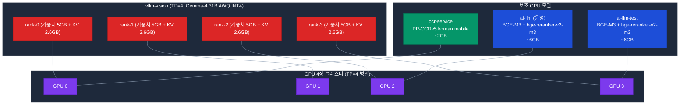
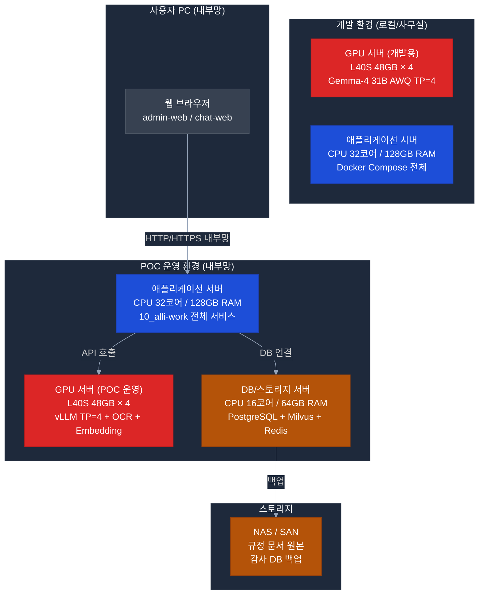

# POC 인프라 사전 체크 — H/W (하드웨어)

> **작성일**: 2026-04-21
> **기준**: `projects/20_alli-llm/docker-compose.prod.yaml` + `.env.prod` 실제 운영 구성
> **중요**: GPU 서버는 조달 리드타임이 2~3개월 이므로 **즉시 발주 필요**

> **📌 고객 확인 필수**: [13-customer-checklist.md D 인프라 요건](../challenges/13-customer-checklist.md#d-인프라-요건-p1--중요) (GPU 보유/임대/클라우드 결정, 서버 사양 확정)

---

## 1. GPU 서버 — 최우선 조달 항목

### 1.1 GPU 사용 모델 전체 스택 (현재 운영 구성)



### 1.2 GPU별 VRAM 할당표 (16K context 기준)

| GPU | vllm-vision 랭크 | 보조 모델 | 사용 VRAM | 필요 VRAM (여유 30%) |
|:---:|:-----------------:|---------|:--------:|:----------------:|
| **GPU 0** | rank-0 (9.1 GB) | ocr-service (2 GB) | **11.1 GB** | **≥ 16 GB** |
| **GPU 1** | rank-1 (9.1 GB) | 없음 | **9.1 GB** | **≥ 14 GB** |
| **GPU 2** | rank-2 (9.1 GB) | ai-llm (6 GB) | **15.1 GB** | **≥ 22 GB** |
| **GPU 3** | rank-3 (9.1 GB) | ai-llm-test (6 GB) | **15.1 GB** | **≥ 22 GB** |

**→ 최소 GPU 사양: VRAM 24GB × 4장** (GPU 2/3 기준)

### 1.3 토큰 사용량에 따른 KV Cache 재산정 (Gemma-4 31B)

#### Gemma-4 31B-it-AWQ 모델 사양

| 항목 | 값 | 설명 |
|------|---|------|
| Parameters | 31B | 30.7B active / 33B total |
| Layers | 62 | Transformer 디코더 레이어 |
| Attention heads (Q) | 32 | — |
| KV heads (GQA) | 16 | Grouped Query Attention |
| Head dim | 160 | — |
| Context length (max) | 128K | Gemma 4 스펙 |
| **양자화** | **AWQ INT4** | 가중치만 INT4, 활성화는 BF16 |

#### KV Cache 공식

```
KV Cache per token = 2 (K, V) × num_layers × num_kv_heads × head_dim × dtype_bytes
                   = 2 × 62 × 16 × 160 × 2 bytes (BF16)
                   = 634,880 bytes = 620 KB/token
```

#### Context Length별 KV Cache 요구량

| Context | KV Cache (1 instance) | **TP=4 per GPU** | 누적 KV (batch N명) |
|:-------:|:-------------------:|:--------------:|------------------|
| 4K (4096) | 2.54 GB | **0.64 GB** | N×0.64 GB |
| 8K (8192) | 5.08 GB | **1.27 GB** | N×1.27 GB |
| **16K (16384) ⭐ 현재 운영** | **10.17 GB** | **2.54 GB** | N×2.54 GB |
| 32K (32768) | 20.34 GB | **5.08 GB** | N×5.08 GB |
| 64K (65536) | 40.67 GB | **10.17 GB** | 단일 인스턴스 한계 |
| 128K (131072) | 81.34 GB | **20.34 GB** | 고용량 GPU 필수 |

#### 배치 처리 고려 (max_num_batched_tokens=16384)

```
동시 처리 가능 조합 (총 16,384 tokens):
  • 1명 × 16K context = 16K tokens → KV 10.17 GB (TP4: 2.54 GB/GPU)
  • 4명 × 4K context  = 16K tokens → KV 10.17 GB (TP4: 2.54 GB/GPU)
  • 16명 × 1K context = 16K tokens → KV 10.17 GB (TP4: 2.54 GB/GPU)

※ max_num_batched_tokens는 KV cache 상한을 결정 — 사용자 수가 아니라 총 토큰 수 기준
```

### 1.4 보조 GPU 모델 상세 VRAM

#### PP-OCRv5 korean mobile (ocr-service)

| 항목 | VRAM | 비고 |
|------|:----:|------|
| 모델 가중치 | ~0.8 GB | INT8 양자화 모델 |
| 추론 activation | ~0.8 GB | 페이지당 4096×4096 이미지 처리 |
| CUDA context | ~0.4 GB | PyTorch 기본 |
| **합계** | **~2 GB** | fraction=0.15 (20GB 기준 3GB 예약) |

> 이전 PaddleOCR-VL 1.5 사용 시 ~5.9GB 필요했으나 2026-04-16 경량 모델로 전환

#### BGE-M3 + bge-reranker-v2-m3 (ai-llm)

| 모델 | 크기 | VRAM (FP16) | 최대 batch 시 |
|------|:---:|:---------:|:-----------:|
| BGE-M3 (임베딩) | 568M | 1.14 GB | batch=64 시 ~3 GB |
| bge-reranker-v2-m3 | 568M | 1.14 GB | batch=32 시 ~2.5 GB |
| PyTorch buffer | — | ~0.5 GB | — |
| **합계** | — | **~3 GB** 대기 / **~6 GB** 피크 | fraction=0.30 (20GB 기준 6GB) |

#### vllm-vision 랭크별 (Gemma-4 31B AWQ TP=4)

| 항목 | per GPU (TP4) | 전체 |
|------|:-----------:|:----:|
| 모델 가중치 (AWQ INT4) | 5 GB | 20 GB |
| KV Cache (16K context) | 2.54 GB | 10.17 GB |
| Activation + workspace | 1.5 GB | 6 GB |
| CUDA context | 0.4 GB | 1.6 GB |
| **합계** | **9.44 GB** | **37.77 GB** |
| vLLM 예약 (util=0.68) | 13.6 GB | 54.4 GB |

---

## 2. GPU 사양 3가지 시나리오

### 2.1 시나리오 A — 최소 사양 (현재 운영 수준)

```
용도     : 16K context, 현재 설정 유지, 동시 사용자 4~8명
GPU      : 24 GB × 4장 (L4 / RTX A5000 / RTX 4090 / RTX 5090)
총 VRAM  : 96 GB
gpu_memory_util : 0.80 (안정)
권장 모델:
  - NVIDIA L4 (24GB, 72W) — 데이터센터용, 냉각 용이 ⭐
  - NVIDIA RTX A5000 (24GB, 230W) — 데스크톱 워크스테이션
  - NVIDIA RTX 4090 (24GB, 450W) — 소비자용 (서버 탑재 제약)
예산     : 800~2,000만원 (GPU만, 1장 200~500만원)
```

### 2.2 시나리오 B — 권장 사양 (32K context + 안정성) ⭐

```
용도     : 32K context, 동시 사용자 16명, OCR-VL 1.5 복구, 예비 20%
GPU      : 48 GB × 4장 (L40S / A40 / RTX 6000 Ada)
총 VRAM  : 192 GB
gpu_memory_util : 0.85 (안정 + 여유)
권장 모델:
  - NVIDIA L40S (48GB, 350W) — 2024년 릴리스, AI 서버 표준 ⭐
  - NVIDIA A40 (48GB, 300W) — 기존 설계 기준, 조달 용이
  - NVIDIA RTX 6000 Ada (48GB, 300W) — 워크스테이션용
예산     : 4,000~6,000만원 (GPU만, 1장 1,000~1,500만원)
```

### 2.3 시나리오 C — 고급 사양 (128K context + 확장 대비)

```
용도     : 128K context (대용량 규정 전체 인입), 모델 확장 대비
GPU      : 80 GB × 4장 (A100 / H100)  또는 × 2장 TP=2
총 VRAM  : 320 GB (× 4) / 160 GB (× 2)
권장 모델:
  - NVIDIA A100 SXM 80GB (400W) — 이전 세대 고성능
  - NVIDIA H100 SXM 80GB (700W) — 최신, 2배 빠른 추론 ⭐
  - NVIDIA H200 (141GB, 700W) — 2025 출시, 메모리 대용량
예산     : 1억~3억원 (GPU만)
```

### 2.4 시나리오 비교표

| 구분 | A 최소 | **B 권장 ⭐** | C 고급 |
|------|:------:|:---------:|:------:|
| GPU 모델 | L4 24GB × 4 | **L40S 48GB × 4** | H100 80GB × 4 |
| 총 VRAM | 96 GB | **192 GB** | 320 GB |
| Gemma-4 컨텍스트 | 16K | **32K** | 128K |
| OCR 모델 | PP-OCRv5 (2GB) | **PP-OCRv5 또는 PaddleOCR-VL (6GB)** | 모든 OCR 모델 |
| 동시 사용자 (추정) | 4~8명 | **16명** | 32명+ |
| GPU 예산 | 800~2,000만원 | **4,000~6,000만원** | 1억~3억원 |
| 조달 기간 | 4~8주 | **8~12주** | 12~24주 (H100 수급) |
| POC 적합 | ✅ 빠른 검증 | **✅ 현실적 균형** | ❌ 과투자 |

---

## 3. 서버 구성 개요



### 3.1 GPU 서버 권장 스펙 (시나리오 B 기준)

| 항목 | 최소 (시나리오 A) | **권장 (시나리오 B) ⭐** | 비고 |
|------|:--------------:|:--------------------:|------|
| GPU | L4 24GB × 4 | **L40S 48GB × 4** | TP=4 병렬 추론 |
| CPU | AMD EPYC 32코어 | **AMD EPYC 64코어 (또는 Xeon Gold)** | PyTorch 데이터 로더 |
| RAM | 128 GB DDR5 | **256 GB DDR5 (ECC)** | 모델 로드 + KV 캐시 |
| SSD (System) | NVMe 1 TB | **NVMe 2 TB** | OS + 컨테이너 |
| SSD (Model) | NVMe 2 TB | **NVMe 4 TB** | Gemma-4 31B AWQ (20GB) + 여러 모델 |
| 네트워크 | 10 GbE | **25 GbE 또는 100 GbE** | 내부망 + 노드 간 통신 |
| 전원 PSU | 2,000W | **3,000W + 이중화** | L40S 4장 + CPU + 주변 |
| 서버 폼팩터 | 2U 또는 4U | **4U GPU 서버** | L40S DW 2슬롯 × 4장 |
| 냉각 | 공냉 (4U) | **공냉 (4U) 또는 수냉** | TDP 총 1,400W+ |

### 3.2 GPU 사용 패턴 검증 (시나리오 B 기준, L40S 48GB × 4)

| GPU | 사용 VRAM (16K) | 사용 VRAM (32K) | 여유 (48GB 기준) |
|:---:|:-------------:|:-------------:|:------------:|
| GPU 0 | 11.1 GB | 13.6 GB | 34.4 GB (71%) |
| GPU 1 | 9.1 GB | 11.6 GB | 36.4 GB (76%) |
| GPU 2 | 15.1 GB | 17.6 GB | 30.4 GB (63%) |
| GPU 3 | 15.1 GB | 17.6 GB | 30.4 GB (63%) |

**→ L40S 48GB × 4 기준으로 여유 확보, 향후 OCR-VL 복구/추가 모델 탑재 가능**

---

## 4. 애플리케이션 서버

### 4.1 권장 스펙

| 항목 | 개발 서버 | **POC 운영 서버** |
|------|---------|:------------:|
| CPU | 32코어 이상 (Intel/AMD) | **32코어 이상** |
| RAM | 64 GB | **128 GB** |
| SSD | 1 TB NVMe | **2 TB NVMe** |
| OS | Ubuntu 22.04 LTS | **Ubuntu 22.04 LTS** |
| 네트워크 | 1 GbE / 10 GbE | **10 GbE** |

### 4.2 실행 서비스 목록 (Docker Compose)

| 서비스 | 포트 | RAM 요구 | CPU |
|--------|:---:|:-------:|:---:|
| auth-api | 4003 | 512 MB | 0.5코어 |
| admin-api | 4000 | 768 MB | 0.5코어 (알림 모듈 포함) |
| admin-web | 3001 | 512 MB | 0.5코어 |
| chat-api | 4002 | 512 MB | 0.5코어 |
| chat-web | 3000 | 512 MB | 0.5코어 |
| ai-assistant | 4005 | 2 GB | 2코어 (compliance_graph 포함) |
| ai-rag | 4006 | 1 GB | 1코어 |
| erp-mcp | 4010 | 512 MB | 0.5코어 |
| sql-runner | 4004 | 512 MB | 0.5코어 |
| groupware-mcp | 4011 | 512 MB | 0.5코어 |
| audit-anomaly | 4012 | 2 GB | 2코어 |
| **합계** | — | **~9 GB** | **~9 코어** |

→ **128 GB RAM / 32 코어** 서버에서 여유 있게 운영 가능

---

## 5. DB / 스토리지 서버

| 항목 | 스펙 | 비고 |
|------|------|------|
| CPU | 16코어 이상 | PostgreSQL + Milvus 동시 운영 |
| RAM | 64 GB 이상 | Milvus 인메모리 인덱스 |
| **SSD (DB)** | **2 TB NVMe** | PostgreSQL 데이터 |
| **SSD (Vector)** | **2 TB NVMe** | Milvus 벡터 인덱스 |
| HDD (Archive) | 4 TB | 문서 원본, 감사 로그 |

### 5.1 저장소별 예상 용량

| 데이터 | 예상 크기 | 비고 |
|--------|---------|------|
| PostgreSQL (전체 DB) | ~100 GB | 감사 이력(alli-audit), 알림 이력 등 |
| Milvus (규정 벡터) | ~50 GB | 규정 문서 10종 임베딩 (BGE-M3 1024-dim) |
| Milvus (감사 지식) | ~30 GB | 감사 패턴 지식 베이스 |
| MinIO (문서 원본) | ~200 GB | PDF/HWP 원본 파일 |
| Redis | ~10 GB | 임베딩 캐시, Pub/Sub |
| LLM 모델 (GPU 서버) | **~30 GB** | Gemma-4 31B AWQ (20GB) + BGE-M3 (2GB) + bge-reranker (2GB) + OCR (3GB) + 여유 |
| **합계** | **~420 GB** | 여유분 포함 **2 TB 권장** |

---

## 6. 환경별 구성 요약

### 6.1 개발 환경 (최소 구성)

```
목적: 개발자 로컬 또는 사무실 개발 서버
GPU  : L4 24GB × 2 (또는 RTX 4090 24GB × 2, 사무실 환경)
       - vllm-vision TP=2로 축소 운영
       - ocr/embedding은 CPU 모드 전환 가능
App  : 고사양 워크스테이션 (CPU 32코어, RAM 64GB)
DB   : App 서버와 공유 (개발 단계)
예산 : 약 2,000~3,000만원 (GPU 2장 + 서버)
```

### 6.2 POC 운영 환경 (권장 구성, 시나리오 B)

```
목적: 고객사 내부망 운영 서버
GPU  : L40S 48GB × 4 (또는 A40 48GB × 4)
       - vllm-vision (Gemma-4 31B AWQ) TP=4
       - ocr-service + ai-llm embedding/rerank 공존
App  : CPU 32코어, RAM 128GB
DB   : CPU 16코어, RAM 64GB, SSD 4TB
예산 : 약 7,000~9,000만원 (신규 구매 시)
       └ GPU 4,000~6,000만 + 서버/DB 3,000만원
```

### 6.3 시나리오별 예산 비교 (GPU 중심)

| 시나리오 | GPU 구성 | GPU 예산 | 전체 인프라 (GPU+App+DB) |
|---------|---------|:-------:|:-------------------:|
| A 최소 | L4 24GB × 4 | 1,500만원 | **4,500만원** |
| **B 권장 ⭐** | **L40S 48GB × 4** | **5,000만원** | **8,000만원** |
| C 고급 | H100 80GB × 2 | 1.5억원 | **1억 8,000만원** |
| 클라우드 임대 (4개월) | A100 80GB × 4 (NHN/KT) | **1,600만원/월 × 4 = 6,400만원** | 별도 서버 불필요 |

**클라우드 프라이빗 옵션**: 내부망 제약 완화 가능 시 **네이버클라우드/NHN/KT 프라이빗 GPU** 임대 검토 (POC 4개월 단기 유리)

---

## 7. 사전 체크리스트

```
[GPU 서버 조달]
□ GPU 서버 보유 여부 확인 (기관 보유 서버 재활용 가능한지)
□ GPU VRAM 확인 (시나리오 A 최소 24GB × 4 / 시나리오 B 권장 48GB × 4)
□ GPU 개수 확인 (TP=4 운영 시 동일 모델 4장 필수)
□ 신규 구매 시 조달 계획 수립 (L40S 리드타임 8~12주, A40 4~8주)
□ 데이터센터 랙 공간 및 전원 용량 확인 (L40S 4장 = 1,400W+)
□ GPU 드라이버 설치 권한 확인 (Ubuntu + CUDA 12.4+)
□ NVLink/NVSwitch 여부 (TP=4 통신 성능 영향)

[애플리케이션 서버]
□ 서버 OS Ubuntu 22.04 LTS 설치 또는 재설치 가능 여부
□ Docker 25+ 설치 권한
□ 내부망 IP 할당 (고정 IP 필요)
□ 포트 개방 가능 여부 (3000~4015 범위 + 6001~6031 범위)

[스토리지]
□ SSD 용량 확인 (최소 2 TB NVMe, 권장 4 TB)
□ NAS/공유 스토리지 마운트 가능 여부 (문서 원본 저장)
□ 모델 저장용 별도 NVMe (최소 500GB, 권장 1TB)

[전력/냉각]
□ 서버실 전력 용량 (GPU 서버 추가 수용 가능한지)
□ 서버실 냉각 용량 (L40S 4장 + CPU = 1,800W+ 발열)
□ 무정전 전원(UPS) 용량 확인
```

---

## 8. 기관 서버 자원 활용 가능성 체크

| 항목 | 확인 필요 사항 | 담당 부서 |
|------|-------------|---------|
| 기존 서버 현황 | 유휴 서버 목록 및 스펙 | 정보시스템팀 |
| GPU 카드 보유 여부 | AI 연구용 GPU 보유 여부 (L4/A40/L40S/A100) | 정보시스템팀 |
| 클라우드 허용 여부 | 프라이빗 클라우드 or 온프레미스만 허용 | 보안팀 |
| 서버 증설 예산 | 장비 구매 예산 편성 가능 여부 | 예산담당팀 |

---

## 9. 관련 문서

- [sw-infrastructure.md](sw-infrastructure.md) — S/W 스택
- [network-infrastructure.md](network-infrastructure.md) — 네트워크 구성
- [../improvements/ai-llm.md](../improvements/ai-llm.md) — LLM 모델 상세 (Gemma-4 31B AWQ, BGE-M3, PP-OCRv5)
- [../challenges/13-customer-checklist.md](../challenges/13-customer-checklist.md) — 고객 인프라 체크리스트
