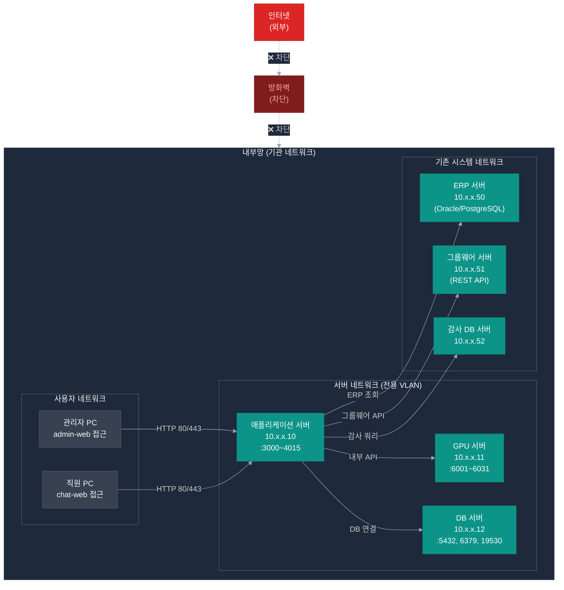

# POC 인프라 사전 체크 — 네트워크

> **작성일**: 2026-04-21
> **목적**: POC 내부망 구성, 방화벽 정책, 포트 개방 사전 협의
> **전제**: 내부망 전용 구축 (인터넷 완전 차단 또는 부분 허용 여부 결정 필요)

> **📌 주요 포트 (실제 운영 기준)**:
>
> **10_alli-work 서비스** (애플리케이션 서버):
> - 3000 chat-web / 3001 admin-web (웹 접근)
> - 4000 admin-api / 4002 chat-api / 4003 auth-api (REST)
> - 4004 sql-runner / 4005 ai-assistant / 4006 ai-rag / 4010 erp-mcp (내부)
> - 4011 groupware-mcp / 4012 audit-anomaly (신규)
>
> **20_alli-llm 서비스** (GPU 서버):
> - 6001 ai-llm (FastAPI 게이트웨이, 운영) / 6002 ai-llm-test (테스트)
> - 6003 Gradio UI
> - **6012 vllm-vision (Gemma-4 31B AWQ TP=4 — coder/chat/vision 통합)**
> - 6014 ocr-service (PP-OCRv5)
> - 6031 Redis (임베딩 캐시)

---

## 네트워크 구성 개요



---

## 1. 네트워크 접근 방식 결정 (필수 협의)

| 시나리오 | 설명 | 권장 여부 |
|---------|------|:--------:|
| **완전 내부망** | 인터넷 완전 차단, 모든 소프트웨어 오프라인 | ✅ 보안 최우선 |
| **부분 허용** | 개발 서버만 허용 (HuggingFace 모델 다운로드 등) | △ 개발 편의성 |
| **클라우드 혼합** | 일부 서비스 프라이빗 클라우드 활용 | ❌ 보안 정책 위반 가능 |

> **권장**: 완전 내부망 구성. 모델 다운로드는 인터넷 가능한 외부 PC에서 먼저 수행 후 USB/이동식 디스크로 이전.

---

## 2. 서버 IP 주소 설계

> 실제 IP 대역은 기관 네트워크 담당자와 협의하여 결정

| 서버 | 역할 | IP (예시) | 비고 |
|------|------|:--------:|------|
| 애플리케이션 서버 | 웹/API 서비스 전체 | 10.10.1.10 | 고정 IP 필요 |
| GPU 서버 | LLM 추론 | 10.10.1.11 | 고정 IP 필요 |
| DB 서버 | PostgreSQL/Milvus/Redis | 10.10.1.12 | 고정 IP 필요 |
| ERP DB 서버 | 기존 ERP (Read-Only) | 10.10.2.x | 기존 서버 IP |
| 그룹웨어 서버 | 기존 그룹웨어 API | 10.10.2.x | 기존 서버 IP |
| 감사 DB 서버 | 감사 데이터 (Read-Only) | 10.10.2.x | 기존 서버 IP |
| 관리자 PC | admin-web 접근 | 10.10.0.x | DHCP 또는 고정 |

---

## 3. 포트 개방 요청 목록

### 3.1 사용자 → 애플리케이션 서버 (방화벽 개방 필요)

| 포트 | 프로토콜 | 서비스 | 방향 | 필요 사유 |
|:---:|---------|--------|------|---------|
| 80 | TCP | HTTP (admin-web) | 사용자 → App | 관리자 대시보드 접근 |
| 443 | TCP | HTTPS (admin-web) | 사용자 → App | SSL 적용 시 |
| 3000 | TCP | chat-web | 사용자 → App | 채팅 UI |
| 3001 | TCP | admin-web (개발) | 개발자 → App | 개발 환경만 |

### 3.2 애플리케이션 서버 내부 통신 (서버 간)

| 포트 | 서비스 | 출발 | 목적지 | 필요 사유 |
|:---:|--------|------|--------|---------|
| 4000 | admin-api | App 내부 | App 내부 | NestJS API |
| 4002 | chat-api | App 내부 | App 내부 | 채팅 백엔드 |
| 4003 | auth-api | App 내부 | App 내부 | 인증 |
| 4004 | sql-runner | App 내부 | App 내부 | SQL 실행 |
| 4005 | ai-assistant | App 내부 | App 내부 | AI 오케스트레이터 |
| 4006 | ai-rag | App 내부 | App 내부 | RAG 검색 |
| 4010 | erp-mcp | App 내부 | App 내부 | ERP MCP |
| 4011 | groupware-mcp | App 내부 | App 내부 | 그룹웨어 MCP |
| 4012 | audit-anomaly | App 내부 | App 내부 | 감사 탐지 |
| 4013 | notify-service | App 내부 | App 내부 | 알림 서비스 |
| 4014 | doc-compliance | App 내부 | App 내부 | 문서 적합성 |

### 3.3 App 서버 → GPU 서버 통신

| 포트 | 서비스 | 필요 사유 |
|:---:|--------|---------|
| 6001 | ai-llm (FastAPI) | LLM 추론 API |
| 6012 | vLLM Coder | 텍스트 생성 |
| 6013 | vLLM Vision | 비전 모델 |
| 6014 | OCR 서비스 | PaddleOCR |
| 6031 | Redis (LLM 서버) | 임베딩 캐시 |

### 3.4 App/DB 서버 → DB 서버 통신

| 포트 | 서비스 | 필요 사유 |
|:---:|--------|---------|
| 5432 | PostgreSQL | 메인 DB |
| 6379 | Redis | 캐시/Pub/Sub |
| 19530 | Milvus gRPC | 벡터 검색 |
| 9000 | MinIO | 파일 저장소 |
| 9090 | Prometheus | 메트릭 수집 |
| 3100 | Grafana | 모니터링 대시보드 |

### 3.5 App 서버 → 기존 시스템 통신 (외부 허용)

| 포트 | 서비스 | 출발 | 목적지 | 필요 사유 |
|:---:|--------|------|--------|---------|
| 1521 / 5432 | ERP DB | App 서버 | ERP DB 서버 | Read-Only SQL 조회 |
| 8080 / 443 | 그룹웨어 API | App 서버 | 그룹웨어 서버 | REST API 호출 |
| 587 | SMTP | App 서버 | 메일 서버 | 이메일 알림 발송 |
| 감사DB 포트 | 감사 DB | App 서버 | 감사 DB 서버 | Read-Only 감사 쿼리 |

---

## 4. DNS 설정 요청

| 도메인 (예시) | IP | 용도 |
|-------------|:---:|------|
| `poc-admin.internal` | 10.10.1.10 | admin-web 내부 도메인 |
| `poc-chat.internal` | 10.10.1.10 | chat-web 내부 도메인 |
| `poc-api.internal` | 10.10.1.10 | API 서버 내부 도메인 |

> 내부 DNS 서버가 없는 경우: `/etc/hosts` 파일 수동 배포 (각 PC에 추가)  
> 권장: 기관 내부 DNS 서버에 A 레코드 추가 요청

---

## 5. SSL/TLS 인증서 처리

| 환경 | 방식 | 비고 |
|------|------|------|
| **개발 환경** | 자체 서명 인증서 (Self-signed) | 브라우저 경고 허용 |
| **POC 데모 환경** | 내부 CA 인증서 또는 자체 서명 | 기관 내부 CA 있으면 발급 요청 |
| **운영 환경 (POC 이후)** | 공인 SSL 인증서 | 도메인 등록 및 인증서 구매 필요 |

---

## 6. 네트워크 보안 요건

| 항목 | 설정 | 비고 |
|------|------|------|
| 서버 간 통신 암호화 | TLS 1.2 이상 권장 | 내부망이라도 민감 데이터 암호화 |
| DB 접근 IP 제한 | App 서버 IP만 허용 | PostgreSQL pg_hba.conf 설정 |
| ERP DB Read-Only | SELECT 권한만 부여 | 쓰기 절대 불가 |
| 감사 DB Read-Only | SELECT 권한만 부여 | 데이터 변조 방지 |
| API 인증 | JWT Bearer Token | 내부 서비스 간도 인증 |
| 관리자 웹 접근 IP | 담당자 PC IP만 허용 | admin-web 접근 제한 |

---

## 7. 사전 체크리스트

```
[네트워크 구성]
□ POC 서버 전용 VLAN 또는 네트워크 세그먼트 설정 가능 여부
□ 고정 IP 주소 할당 (App/GPU/DB 서버 각 1개 이상)
□ 내부 DNS A 레코드 추가 요청 (또는 hosts 파일 배포)
□ 서버 간 통신 방화벽 규칙 설정 (위 표 기준)

[기존 시스템 연동]
□ ERP DB 서버 → App 서버 방화벽 허용 (1521 또는 5432)
□ 그룹웨어 서버 → App 서버 방화벽 허용 (8080 또는 443)
□ 감사 DB 서버 → App 서버 방화벽 허용
□ 메일 서버 SMTP 587 포트 개방 (이메일 알림 필요 시)

[보안]
□ ERP DB 계정 — SELECT Only 권한 확인
□ 감사 DB 계정 — SELECT Only 권한 확인
□ POC 서버 원격 접속 방식 결정 (SSH 키 기반, 특정 IP만 허용)

[내부망 격리]
□ POC 서버에서 인터넷 접근 차단 여부 결정
□ 인터넷 차단 시 소프트웨어 배포 방법 결정 (내부 미러 서버 또는 USB)
□ LLM 모델 파일 내부망 이전 방법 결정 (이동식 디스크 반입 허용 여부)
```

---

## 8. 담당 부서별 협의 사항

| 사항 | 담당 부서 | 필요 시점 |
|------|---------|---------|
| VLAN/네트워크 세그먼트 설정 | 정보시스템팀 (네트워크 담당) | W1 |
| 고정 IP 할당 | 정보시스템팀 | W1 |
| 방화벽 포트 개방 신청 | 보안팀 | W1 |
| ERP DB 접근 허용 | 보안팀 + ERP 운영팀 | W2 |
| 그룹웨어 API 접근 허용 | 보안팀 + 그룹웨어 운영팀 | W2 |
| 감사 DB 접근 허용 | 보안팀 + 감사팀 | W2 |
| 내부 DNS 레코드 추가 | 정보시스템팀 | W2 |
| SSL 인증서 발급 | 정보시스템팀 | W3 |
