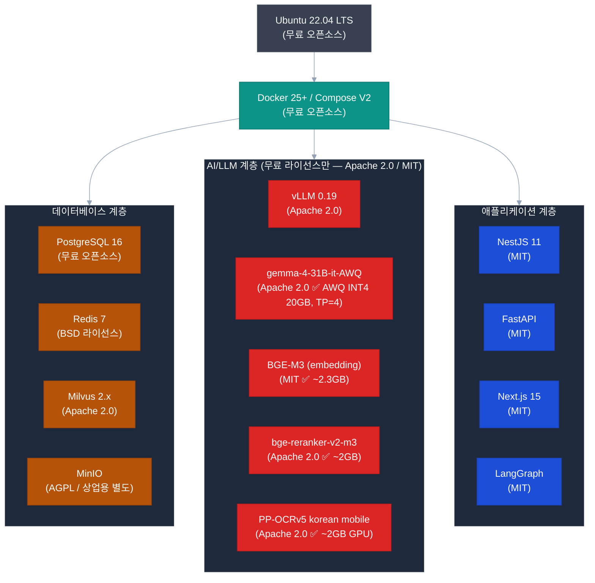

# POC 인프라 사전 체크 — S/W (소프트웨어)

> **작성일**: 2026-04-21
> **목적**: POC 구성에 필요한 S/W 스택, 라이선스, 오픈소스 현황 사전 확인
> **핵심**: 모든 S/W는 오픈소스 또는 무료 라이선스 기반 — 별도 S/W 구매 불필요

> **📌 POC 스택 요약**: Python 3.12 + FastAPI + LangGraph + Milvus 2.5 / NestJS 11 + TypeORM / Next.js 15 + React 19 / Docker Compose / Redis / PostgreSQL / vLLM + PaddleOCR

---

## 소프트웨어 전체 구성



---

## 1. 기반 소프트웨어

### 1.1 운영체제

| 항목 | 선택 | 버전 | 라이선스 | 비용 |
|------|------|------|---------|:----:|
| **서버 OS** | Ubuntu Server | 22.04.3 LTS | GPL | 무료 |
| **컨테이너** | Docker Engine | 25.x | Apache 2.0 | 무료 |
| **오케스트레이션** | Docker Compose V2 | 2.x | Apache 2.0 | 무료 |
| **모니터링** | Prometheus + Grafana | 최신 | Apache 2.0 | 무료 |
| **역방향 프록시** | Nginx | 1.25.x | BSD | 무료 |
| **GPU 드라이버** | NVIDIA Driver + CUDA 12.x | 12.3+ | NVIDIA EULA | 무료 |
| **Container Runtime** | NVIDIA Container Toolkit | 최신 | Apache 2.0 | 무료 |

### 1.2 런타임

| 항목 | 선택 | 버전 | 라이선스 | 비용 |
|------|------|------|---------|:----:|
| **Python** | CPython | 3.12 | PSF | 무료 |
| **Node.js** | Node.js | 22.x LTS | MIT | 무료 |
| **패키지 매니저** | pnpm | 10.x | MIT | 무료 |
| **빌드 도구** | Turborepo | 2.5 | MIT | 무료 |

---

## 2. 데이터베이스 및 미들웨어

| 소프트웨어 | 버전 | 라이선스 | 비용 | 용도 |
|-----------|------|---------|:----:|------|
| **PostgreSQL** | 16.x | PostgreSQL License | 무료 | 서비스 메인 DB |
| **Redis** | 7.x | BSD / RSAL | 무료* | 캐시, Pub/Sub, 세션 |
| **Milvus** | 2.4.x | Apache 2.0 | 무료 | 규정 벡터 DB |
| **MinIO** | AGPL 3.0 | AGPL / 상업용 | ⚠️ 확인 필요 | 문서 파일 저장소 |

> **MinIO 라이선스 주의**: AGPL 3.0은 서버에서 서비스 제공 시 소스코드 공개 의무 발생 가능.  
> 내부 전용 사용(공개 서비스 아님)이므로 대부분 허용되나 법무팀 확인 권장.  
> 대안: 로컬 파일 시스템(NFS/POSIX) 사용 시 라이선스 이슈 없음.

---

## 3. AI/LLM 소프트웨어

### 3.1 LLM 추론 엔진

| 소프트웨어 | 라이선스 | 비용 | 비고 |
|-----------|---------|:----:|------|
| **vLLM** | Apache 2.0 | 무료 | GPU 기반 LLM 추론 서버 |
| **LangGraph** | MIT | 무료 | AI 에이전트 오케스트레이션 |
| **FastMCP** | MIT | 무료 | MCP 서버 프레임워크 |

### 3.2 LLM 모델 구성 (실제 운영)

> **기준**: `projects/20_alli-llm/docker-compose.prod.yaml` + `.env.prod`
> **라이선스 정책**: 비용 발생 없는 모델만 사용 — **Apache 2.0 / MIT 한정**

#### 실제 운영 모델 구성

| 서비스 | 포트 | GPU | 모델 | 양자화 | VRAM | 라이선스 |
|--------|:---:|:---:|------|:-----:|:----:|---------|
| **vllm-vision** (통합: coder+chat+vision) | 6012 | **GPU 0~3 (TP=4)** | `gemma-4-31B-it-AWQ` | **AWQ INT4** | **20 GB (전체)** | Apache 2.0 ✅ |
| **ai-llm** (embedding) | 6001 | GPU 2 (fraction 0.30) | `BAAI/bge-m3` | FP16 | ~2.3 GB | **MIT** ✅ |
| **ai-llm** (rerank) | 6001 | GPU 2 (fraction 0.30) | `BAAI/bge-reranker-v2-m3` | FP16 | ~2 GB | Apache 2.0 ✅ |
| **ocr-service** | 6014 | GPU 0 (fraction 0.15) | `PP-OCRv5 korean mobile` | INT8 | ~2 GB | Apache 2.0 ✅ |

> **중요 — 모델 통합 서빙**: `vllm-vision` 서비스의 `--served-model-name coder chat vision`으로 **3가지 모델명이 동일한 Gemma-4 31B AWQ 엔드포인트로 라우팅**. 즉 별도의 Coder/Vision 서비스가 존재하지 않으며 단일 모델이 모든 역할 수행 (멀티모달 지원).

#### vllm-vision 설정 파라미터 (.env.prod)

| 파라미터 | 값 | 설명 |
|---------|:-:|------|
| `VLLM_VISION_MODEL` | `gemma-4-31B-it-AWQ` | 모델 경로 |
| `VLLM_VISION_GPU_MEMORY_UTIL` | `0.68` | GPU 2/3에 ai-llm 공존 → util 인하 |
| `VLLM_VISION_MAX_MODEL_LEN` | `16384` | 16K context (32K 확장 시 VRAM 2배) |
| `VLLM_VISION_MAX_TOKENS` | `16384` | batch 총 토큰 상한 |
| `VLLM_VISION_DTYPE` | `bfloat16` | activation dtype (AWQ는 가중치 INT4) |
| `tensor-parallel-size` | `4` | GPU 4장 분산 (TP=4) |
| `limit-mm-per-prompt` | `{"image":2}` | 이미지 최대 2장/요청 |

#### GPU별 VRAM 할당 (16K context)

| GPU | vllm-vision rank | 보조 모델 | 합계 VRAM | 20GB GPU 여유 |
|:---:|:---------------:|---------|:--------:|:-----------:|
| GPU 0 | rank-0 (9 GB) | ocr-service (2 GB) | **11 GB** | 9 GB |
| GPU 1 | rank-1 (9 GB) | — | **9 GB** | 11 GB |
| GPU 2 | rank-2 (9 GB) | ai-llm embed/rerank (6 GB) | **15 GB** | 5 GB ⚠️ |
| GPU 3 | rank-3 (9 GB) | ai-llm-test embed/rerank (6 GB) | **15 GB** | 5 GB ⚠️ |

> ⚠️ **20 GB GPU에서 GPU 2/3 여유 부족** — 24GB GPU 이상 권장.
> 상세 VRAM 재산정: [../improvements/ai-llm.md](../improvements/ai-llm.md)

#### Gemma-4 31B-it-AWQ 사양

| 항목 | 값 |
|------|---|
| Parameters | 31B (30.7B active) |
| Layers | 62 |
| KV heads (GQA) | 16 |
| Head dim | 160 |
| Max context | 128K (운영 시 16K) |
| 양자화 | **AWQ INT4** (Activation-aware Weight Quantization) |
| 가중치 크기 | 20 GB |
| 라이선스 | Apache 2.0 |
| 멀티모달 | ✅ 이미지 (내장 비전 인코더 27-layer) |

#### KV Cache 요구량 (Context별, TP=4 per GPU)

```
KV Cache per token = 2 × 62 × 16 × 160 × 2 bytes ≈ 620 KB

4K context   → TP4: 0.64 GB/GPU
8K context   → TP4: 1.27 GB/GPU
16K context  → TP4: 2.54 GB/GPU  ⭐ 현재 운영
32K context  → TP4: 5.08 GB/GPU
128K context → TP4: 20.34 GB/GPU (고용량 GPU 필수)
```

상세 계산: [../improvements/ai-llm.md#2-gemma-4-31b-it-awq-상세-및-gpu-vram-재산정](../improvements/ai-llm.md)

#### Embedding / Rerank (ai-llm 컨테이너 내 sentence-transformers)

| 모델 | 개발사 | 라이선스 | VRAM | 차원/특징 |
|------|--------|---------|:----:|---------|
| **BGE-M3** ⭐ 운영 | BAAI | MIT ✅ | ~2.3 GB | dim=1024, Dense+Sparse+ColBERT, max 8192 tokens |
| **bge-reranker-v2-m3** ⭐ 운영 | BAAI | Apache 2.0 ✅ | ~2 GB | Cross-encoder, multilingual |

> **BGE-M3는 한국어 + 다국어 지원**. 내부망에서 추가 학습 없이 즉시 활용 가능.

#### OCR 엔진

| 모델 | 라이선스 | VRAM | 특징 |
|------|---------|:----:|------|
| **PP-OCRv5 korean mobile** ⭐ 운영 | Apache 2.0 ✅ | ~2 GB (GPU) | 2026-04-16 전환, vLLM TP=4와 GPU 공존 |
| PaddleOCR-VL 1.5 (대안) | Apache 2.0 ✅ | ~5.9 GB (GPU) | 문서 구조 파싱, 권장 GPU 사양 시 복구 가능 |

#### 제외 모델 및 사유

| 모델 | 제외 사유 |
|------|---------|
| `skt/A.X-4.0-Light` | SKT 독자 라이선스 — 과거 PROD, 2026-04-15 Gemma-4 31B AWQ로 교체 완료 |
| `LGAI-EXAONE/EXAONE-*` | LG AI Research 명시적 협의·계약 필요 |
| `google/gemma-4-E4B` | 2026-04-15 멀티모달 통합으로 별도 Vision 서비스 제거 (31B 내장 비전 인코더로 통합) |
| OpenAI GPT-4, Claude, Gemini API | 내부망 인터넷 차단 — API 호출 불가 |

### 3.3 AI 라이브러리

| 라이브러리 | 라이선스 | 비용 | 용도 |
|-----------|---------|:----:|------|
| PyTorch | BSD | 무료 | DL 프레임워크 |
| scikit-learn | BSD | 무료 | 이상 탐지 ML (Isolation Forest) |
| scipy | BSD | 무료 | 통계 기반 이상 탐지 |
| PaddleOCR | Apache 2.0 | 무료 | 한국어 OCR |
| sentence-transformers | Apache 2.0 | 무료 | KURE-v1 / bge-m3 임베딩 |
| pymilvus | Apache 2.0 | 무료 | Milvus 클라이언트 |

---

## 4. 개발 프레임워크

### 4.1 백엔드

| 프레임워크 | 언어 | 버전 | 라이선스 | 비용 |
|-----------|------|------|---------|:----:|
| NestJS | TypeScript | 11.x | MIT | 무료 |
| FastAPI | Python | 0.115.x | MIT | 무료 |
| TypeORM | TypeScript | 0.3.x | MIT | 무료 |
| SQLAlchemy | Python | 2.x | MIT | 무료 |
| APScheduler | Python | 3.x | MIT | 무료 |

### 4.2 프론트엔드

| 프레임워크 | 버전 | 라이선스 | 비용 |
|-----------|------|---------|:----:|
| Next.js | 15.x | MIT | 무료 |
| React | 18.x | MIT | 무료 |
| TanStack Query | 5.x | MIT | 무료 |
| Tailwind CSS | 3.x | MIT | 무료 |
| shadcn/ui | 최신 | MIT | 무료 |

---

## 5. 개발 도구

| 도구 | 용도 | 라이선스 | 비용 |
|------|------|---------|:----:|
| Git | 버전 관리 | GPL | 무료 |
| GitLab CE (권장) | 내부망 Git 서버 | MIT | 무료 |
| Biome | TypeScript 린트/포맷 | MIT | 무료 |
| Pytest | Python 테스트 | MIT | 무료 |
| Playwright | E2E 테스트 | Apache 2.0 | 무료 |
| Claude Code | AI 보조 개발 | Anthropic | ⚠️ 유료 구독 필요 |

> **Claude Code**: 개발 생산성 3~5배 향상 도구. 인터넷 연결 필요 (내부망에서 외부 API 호출).  
> 내부망 완전 차단 환경이면 오프라인 대안 검토 필요.

---

## 6. 소프트웨어 설치 순서

```
[Phase 0 — 개발 착수 전 (2주 이내)]

STEP 1: 서버 OS 설치
  Ubuntu 22.04 LTS Server
  → 오프라인 설치 (내부망 ISO)

STEP 2: GPU 드라이버 + CUDA
  NVIDIA Driver 535+ + CUDA 12.3
  → 오프라인 패키지 준비 필요

STEP 3: Docker + NVIDIA Container Toolkit
  Docker 25.x + Docker Compose V2
  NVIDIA Container Toolkit

STEP 4: 기반 서비스 컨테이너 실행
  PostgreSQL 16 → Redis 7 → Milvus 2.4 → MinIO

STEP 5: LLM 모델 다운로드 (무료 라이선스 모델만, 인터넷 연결 가능 환경에서)
  HuggingFace에서 모델 파일 다운로드 후 오프라인 서버에 복사

  [POC 운영 확정 모델]
  gemma-4-31B-it-AWQ (vllm-vision TP=4):     ~20 GB (AWQ INT4)
  BAAI/bge-m3 (embedding):                   ~2.3 GB
  BAAI/bge-reranker-v2-m3 (rerank):          ~2 GB
  PP-OCRv5 korean mobile (ocr-service):      ~0.8 GB (PaddlePaddle 모델)

  [다운로드 명령]
  huggingface-cli download google/gemma-4-31b-it-awq --local-dir /data/model/gemma-4-31B-it-AWQ
  huggingface-cli download BAAI/bge-m3 --local-dir /data/model/bge-m3
  huggingface-cli download BAAI/bge-reranker-v2-m3 --local-dir /data/model/bge-reranker-v2-m3
  # PP-OCRv5는 ocr-service Dockerfile 빌드 시 자동 다운로드

  ⚠️ 내부망 이전: 외부 PC 다운로드 → USB/이동식 디스크 → 서버 복사 (/data/model/)
  ⚠️ 총 필요 용량: ~26 GB (AWQ 양자화 기준)
  ⚠️ 모델 저장 위치: /data/model (docker-compose에서 read-only 볼륨 마운트)

STEP 6: vLLM 서버 실행 및 모델 로딩 테스트
  docker compose up -d vllm-vision ai-llm ocr-service redis
```

---

## 7. 오프라인 설치 준비사항 (내부망 격리 환경)

> 내부망 완전 격리 환경에서는 인터넷 의존 패키지를 사전에 수동 준비해야 함

```
[준비 필요 항목]

□ Ubuntu 22.04 LTS ISO 이미지
□ Docker CE 오프라인 패키지 (deb 파일)
□ NVIDIA Driver 오프라인 패키지
□ CUDA 12.3 오프라인 설치 패키지
□ Python pip 패키지 미러 (pip 로컬 미러 구성 또는 tar.gz 수동 준비)
□ Node.js 22.x 오프라인 설치파일
□ LLM 모델 파일 (HuggingFace → USB/이동식 디스크 이전)
□ Docker Hub 이미지 사전 Pull 후 tar 저장 (docker save)
   - postgres:16, redis:7, milvusdb/milvus:latest, minio/minio 등
```

---

## 8. 사전 체크리스트

```
[라이선스 확인]
□ Gemma Terms of Use 내부 행정 시스템 적용 적합성 (Apache 2.0 베이스, 내부망 적용 가능)
□ BGE-M3 MIT 라이선스 확인
□ MinIO AGPL 라이선스 내부 사용 적합성 법무 검토
□ Claude Code 구독 예산 확보 (또는 대안 도구 선택)

[오프라인 환경 준비]
□ pip 패키지 로컬 미러 서버 구축 (또는 wheel 파일 수동 준비)
□ Docker 이미지 사전 Pull 및 tar 저장 완료 (harbor.allsharp.co.kr 레지스트리 사용)
□ LLM 모델 파일 다운로드 및 내부망 이전 완료 (/data/model)
□ PP-OCRv5 PaddleOCR 모델 사전 다운로드 (ocr-paddle-cache 볼륨)

[버전 호환성]
□ Python 3.12 + PyTorch + CUDA 12.4+ 호환성 확인
□ vLLM 0.19.0 + Gemma-4 모델 호환성 (패치 파일 /data/alli-llm/patches/gemma4_mm.py 적용)
□ Node.js 22 + pnpm 10 + Turborepo 2.5 호환성 확인
□ PostgreSQL 16 + TypeORM 0.3 호환성 확인

[GPU 호환성 — 운영 기준]
□ GPU 4장 동일 모델 (TP=4 필수)
□ GPU VRAM 최소 24GB/장 (16K context 기준)
□ GPU VRAM 권장 48GB/장 (32K context + 여유)
□ NVIDIA Driver 535+ / CUDA 12.4+
□ NVLink/NVSwitch 여부 (TP=4 통신 성능 영향)
```
