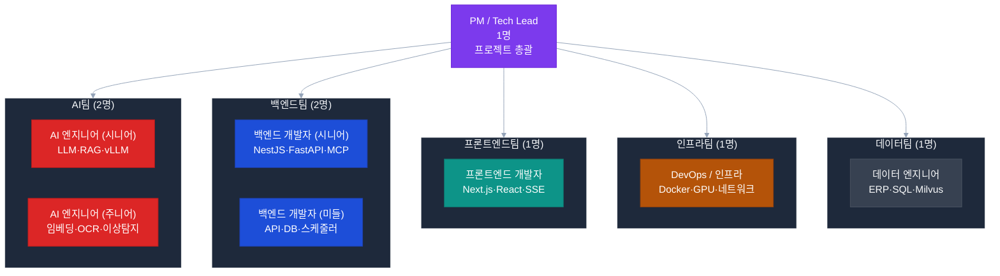
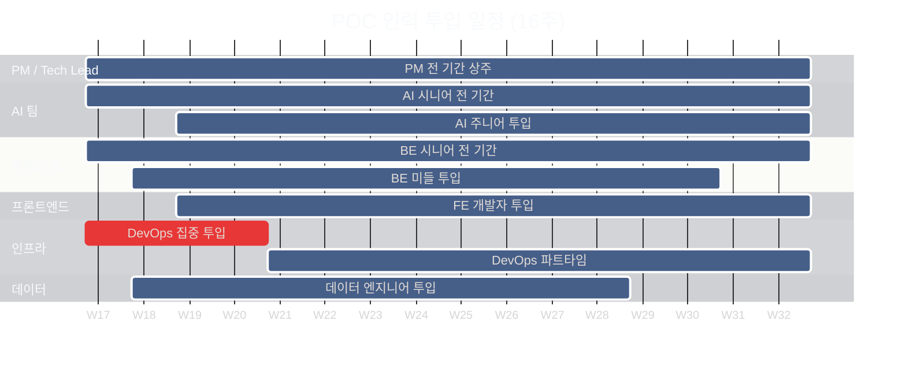

# POC 인프라 사전 체크 — 개발 인력

> **작성일**: 2026-04-21
> **목적**: POC 개발 인력 구성·역할·등급·투입 시점 사전 협의

> **📌 시나리오별 인력 구성**
>
> | 시나리오 | 기간 | 인력 | 비고 |
> |---------|:---:|:---:|------|
> | **시나리오 A (완전 구현)** | 16주 | 8인 | 본 문서 기준 |
> | **시나리오 B ⭐ (권장)** | **13주** | **2인** (D1+D2) + 파트타임 PM | [../02-project-plan.md](../02-project-plan.md#🅱️-시나리오-b--단계형-구현-⭐-권장) |
> | **시나리오 C (빠른 증빙)** | 8주 | 2인 (D1+D2) | 3과제 핵심만 |
>
> 본 문서는 시나리오 A (8인 체제)를 상세 기술한다. 권장 시나리오 B의 2인 체제 상세는 위 링크 참조.

---

## 팀 구성 개요



---

## 1. 역할별 상세 요건

### 1.1 PM / Tech Lead (1명)

| 항목 | 내용 |
|------|------|
| **등급** | 시니어 (10년 이상) |
| **핵심 역할** | 전체 프로젝트 조율, 고객사 커뮤니케이션, 기술 의사결정 |
| **필수 기술** | AI/ML 프로젝트 경험, 공공기관 프로젝트 이해, 기술 아키텍처 설계 |
| **우대 기술** | LLM 기반 서비스 구축 경험, ERP 연동 프로젝트 경험 |
| **투입 기간** | W1 ~ W16 (전 기간) |
| **근무 형태** | 현장 상주 우선 (고객사 내부망 접근 필요) |

### 1.2 AI 엔지니어 시니어 (1명)

| 항목 | 내용 |
|------|------|
| **등급** | 시니어 (7년 이상) |
| **핵심 역할** | vLLM 서버 구축, LangGraph 파이프라인, RAG 아키텍처 설계 |
| **필수 기술** | Python 3.10+, LangChain/LangGraph, vLLM, RAG 구현 경험 |
| **우대 기술** | 한국어 LLM 파인튜닝 경험, Milvus/벡터DB 운영, Gemma/오픈소스 LLM 모델 운영 실습 |
| **투입 기간** | W1 ~ W16 (전 기간) |
| **주요 산출물** | ai-assistant 그래프 3종, ai-rag 규정 컬렉션, ai-llm 프롬프트 최적화 |

### 1.3 AI 엔지니어 주니어 (1명)

| 항목 | 내용 |
|------|------|
| **등급** | 미들~시니어 (4년 이상) |
| **핵심 역할** | 임베딩 파이프라인, OCR 연동, 감사 이상 탐지 ML 구현 |
| **필수 기술** | Python, scikit-learn, PaddleOCR, sentence-transformers |
| **우대 기술** | 이상 탐지 알고리즘 경험, NLP 한국어 처리, FastAPI |
| **투입 기간** | W3 ~ W16 |
| **주요 산출물** | audit-anomaly 서비스, doc-compliance OCR 파이프라인, KR-SBERT 임베딩 |

### 1.4 백엔드 개발자 시니어 (1명)

| 항목 | 내용 |
|------|------|
| **등급** | 시니어 (7년 이상) |
| **핵심 역할** | NestJS 백엔드 아키텍처, MCP 서버 구현, 기존 서비스 확장 |
| **필수 기술** | TypeScript, NestJS 10+, PostgreSQL, Redis, REST API 설계 |
| **우대 기술** | MCP(Model Context Protocol) 이해, FastAPI, ERP 연동 경험 |
| **투입 기간** | W1 ~ W16 |
| **주요 산출물** | erp-mcp, groupware-mcp, notify-service, admin-api 확장 |

### 1.5 백엔드 개발자 미들 (1명)

| 항목 | 내용 |
|------|------|
| **등급** | 미들 (3~5년) |
| **핵심 역할** | FastAPI 서비스 구현, DB 스키마 설계, API 연동 |
| **필수 기술** | Python, FastAPI, SQLAlchemy, PostgreSQL, TypeScript |
| **우대 기술** | APScheduler, Milvus 클라이언트, Docker 컨테이너 운영 |
| **투입 기간** | W2 ~ W14 |
| **주요 산출물** | sql-runner 확장, chat-api 확장, 배치 스케줄러 |

### 1.6 프론트엔드 개발자 (1명)

| 항목 | 내용 |
|------|------|
| **등급** | 미들~시니어 (4년 이상) |
| **핵심 역할** | admin-web 감사 대시보드, chat-web POC UI 확장, SSE 클라이언트 |
| **필수 기술** | React, Next.js 14+, TypeScript, Tailwind CSS, TanStack Query |
| **우대 기술** | SSE/WebSocket 클라이언트 구현, 차트 라이브러리 (Recharts/Chart.js), 대시보드 개발 경험 |
| **투입 기간** | W3 ~ W16 |
| **주요 산출물** | 감사 리스크 대시보드, 규정 Q&A UI, 문서 업로드 UI, 알림 시스템 UI |

### 1.7 DevOps / 인프라 엔지니어 (1명)

| 항목 | 내용 |
|------|------|
| **등급** | 미들~시니어 (4년 이상) |
| **핵심 역할** | Docker Compose 구성, GPU 서버 설정, 내부망 환경 구축 |
| **필수 기술** | Docker, Docker Compose, Ubuntu Linux, NVIDIA Container Toolkit |
| **우대 기술** | vLLM 서버 운영, Nginx 설정, Prometheus/Grafana, 내부망 보안 구성 |
| **투입 기간** | W1 ~ W4 (집중), W5 ~ W16 (파트타임 지원) |
| **주요 산출물** | Docker Compose 전체 구성, GPU 서버 환경, 모니터링 시스템 |

### 1.8 데이터 엔지니어 (1명)

| 항목 | 내용 |
|------|------|
| **등급** | 미들 (3~5년) |
| **핵심 역할** | ERP DB 연동, 규정 문서 전처리·임베딩, Milvus 벡터 DB 구축 |
| **필수 기술** | SQL (Oracle/PostgreSQL), Python, 데이터 파이프라인 구축 경험 |
| **우대 기술** | ERP(SAP/Oracle) 데이터 모델 이해, 벡터 DB 운영, 문서 파싱 (PDF/HWP) |
| **투입 기간** | W2 ~ W12 |
| **주요 산출물** | ERP 데이터 연동, 규정 문서 임베딩 파이프라인, 감사 DB 쿼리 |

---

## 2. 투입 일정 계획 (간트)



---

## 3. Phase별 인력 배치

### Phase 0 — 사전 준비 (W1~W2)

| 인력 | 투입율 | 주요 업무 |
|------|:------:|---------|
| PM / Tech Lead | 100% | 고객사 미팅, 환경 점검, 요구사항 확정 |
| DevOps | 100% | 서버 OS 설치, Docker 구성, GPU 드라이버 |
| BE 시니어 | 50% | 기존 코드베이스 분석, 아키텍처 설계 |
| AI 시니어 | 50% | LLM 모델 다운로드, vLLM 테스트 |
| 데이터 엔지니어 | 50% | ERP DB 접근 방식 협의, 데이터 샘플 수집 |

### Phase 1 — POC 1 ERP·그룹웨어 자동화 (W3~W6)

| 인력 | 투입율 | 주요 업무 |
|------|:------:|---------|
| PM / Tech Lead | 100% | 스프린트 관리, 고객사 피드백 |
| BE 시니어 | 100% | erp-mcp, groupware-mcp 구현 |
| AI 시니어 | 100% | ai-assistant ERP 그래프 구현 |
| 데이터 엔지니어 | 100% | ERP DB 연동, SQL 최적화 |
| BE 미들 | 100% | chat-api 라우팅 확장 |
| FE | 50% | chat-web ERP 모드 UI |
| DevOps | 30% | 환경 안정화, 모니터링 |

### Phase 2 — POC 2 규정·문서 지능화 (W7~W11)

| 인력 | 투입율 | 주요 업무 |
|------|:------:|---------|
| PM / Tech Lead | 100% | 중간 검토, 고객사 보고 |
| AI 시니어 | 100% | RAG Q&A 파이프라인, 한국어 리랭킹 |
| AI 주니어 | 100% | doc-compliance OCR + 적합성 판정 |
| BE 시니어 | 80% | ai-rag 확장, admin-api 규정 관리 API |
| BE 미들 | 80% | notify-service, doc-compliance FastAPI |
| 데이터 엔지니어 | 100% | 규정 문서 임베딩, Milvus 컬렉션 구축 |
| FE | 100% | 규정 Q&A UI, 문서 업로드 UI |

### Phase 3 — POC 3 감사 지능화 (W12~W14)

| 인력 | 투입율 | 주요 업무 |
|------|:------:|---------|
| PM / Tech Lead | 100% | 일정 관리, 리스크 대응 |
| AI 주니어 | 100% | audit-anomaly ML 모델 구현 |
| AI 시니어 | 60% | 감사 이상 탐지 프롬프트, 리스크 스코어링 |
| BE 시니어 | 80% | admin-api 감사 대시보드 API |
| BE 미들 | 50% | sql-runner 감사 쿼리 확장 |
| FE | 100% | 감사 리스크 대시보드, 알림 UI |

### Phase 4 — 통합 테스트·데모 준비 (W15~W16)

| 인력 | 투입율 | 주요 업무 |
|------|:------:|---------|
| PM / Tech Lead | 100% | 데모 시나리오, 고객사 최종 발표 |
| AI 시니어 | 100% | 성능 최적화, 데모 시나리오 검증 |
| BE 시니어 | 100% | 버그 수정, 안정화 |
| FE | 100% | UI 완성도, 데모 준비 |
| DevOps | 100% | 최종 환경 검증, 백업 계획 |

---

## 4. 근무 환경 요건

| 항목 | 요건 | 비고 |
|------|------|------|
| **근무지** | 고객사 내부 또는 원격 | 내부망 접근 방식에 따라 결정 |
| **내부망 접근** | VPN 또는 현장 상주 | 완전 내부망 환경 시 현장 필수 |
| **장비** | 개발 PC 지참 또는 제공 | 고사양 워크스테이션 권장 (RAM 32GB+) |
| **보안 서약** | 기관 보안 정책 준수 | 개인정보 처리 관련 NDA 필수 |
| **출퇴근** | 기관 출입 카드 발급 | 보안 구역 출입 절차 협의 필요 |

---

## 5. 역량 검증 방법 (사전 협의)

> 인력 투입 전 아래 사항을 사전에 확인하여 POC 실패 리스크를 최소화한다.

| 역할 | 검증 방법 | 검증 항목 |
|------|---------|---------|
| AI 시니어 | 기술 인터뷰 + 코드 리뷰 | vLLM 실행 경험, LangGraph 구현 샘플 |
| BE 시니어 | 포트폴리오 검토 | MCP 서버 구현 사례, NestJS 대형 프로젝트 |
| DevOps | 실습 테스트 | Docker Compose 작성, NVIDIA 컨테이너 설정 |
| 데이터 엔지니어 | 실습 테스트 | ERP SQL 쿼리, 벡터 DB 구축 경험 |

---

## 6. 외부 협력 (선택적)

> POC 기간 내 내부 인력으로 충당이 어려운 경우 아래 외부 협력 방안을 검토한다.

| 역할 | 협력 형태 | 비고 |
|------|---------|------|
| Google DeepMind | 기술 참조 | Gemma 4 모델 기술 문서 참고 (Apache 2.0, 협의 불필요) |
| ERP 벤더 | DB 스키마 지원 | 기존 ERP 데이터 모델 문서 제공 요청 |
| 그룹웨어 벤더 | API 문서 제공 | REST API 명세 공유 요청 |
| 법무 자문 | MinIO AGPL 검토 | 1~2시간 자문 (선택적) |

---

## 7. 사전 체크리스트

```
[인력 확보]
□ 역할별 인력 배정 완료 (PM, AI×2, BE×2, FE, DevOps, Data)
□ 고객사 보안 서약서 및 NDA 서명 완료
□ 내부망 접근 계정 신청 (VPN 또는 현장 출입증)
□ 개발 장비 목록 확정 (기관 지원 또는 자체 지참)

[역량 검증]
□ AI 시니어 — vLLM + LangGraph 실습 테스트 완료
□ BE 시니어 — NestJS + MCP 구현 샘플 검토
□ DevOps — Docker + NVIDIA 컨테이너 설정 실습
□ 데이터 엔지니어 — ERP SQL + Milvus 경험 확인

[환경 준비]
□ 개발 PC 고사양 확보 (RAM 32GB+, SSD 1TB+)
□ 내부망 SSH 터널 또는 VPN 설정 가이드 배포
□ 개발 도구 라이선스 (IDE, API 테스트 도구) 확보
□ 협업 도구 결정 (GitLab CE, 이슈 트래커, 의사소통 채널)

[협력사]
□ Gemma 4 모델 HuggingFace 다운로드 경로 확보 (Apache 2.0 — 별도 협의 불필요)
□ ERP 벤더 데이터 스키마 문서 요청 완료
□ 그룹웨어 벤더 API 명세 공유 요청 완료
```

---

## 8. 담당 부서별 협의 사항

| 사항 | 담당 부서 | 필요 시점 |
|------|---------|---------|
| 외부 인력 출입 등록 | 보안팀 | W0 (착수 전) |
| NDA / 보안 서약 | 법무팀 | W0 (착수 전) |
| ERP 담당자 지정 | ERP 운영팀 | W1 |
| 그룹웨어 담당자 지정 | 그룹웨어 운영팀 | W1 |
| 감사 DB 담당자 지정 | 감사팀 | W1 |
| 내부망 개발 계정 발급 | 정보시스템팀 | W1 |
| 주간 진행 보고 체계 | PM + 담당 부서장 | W1 |
