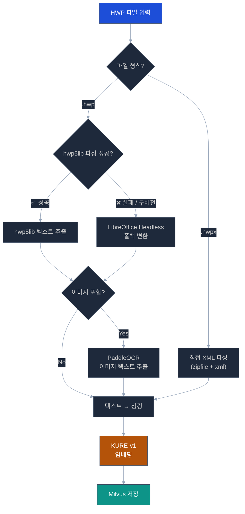
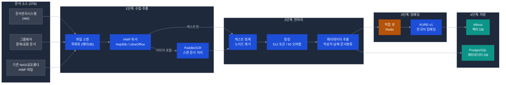

# HWP 대규모 문서 RAG 파이프라인 구축 방안

> **작성일**: 2026-04-21
> **목적**: 기업 보유 HWP 문서(~3TB) → RAG DB(Milvus) 활용 가능화 전략
> **대상**: 문서관리시스템(DMS) + 그룹웨어 내 HWP 파일 일괄 처리
> **관련 문서**: [AI-RAG 개선](./ai-rag.md) | [AI-LLM 선택](./ai-llm.md) | [H/W 인프라](../infra/hw-infrastructure.md)

> **📌 적용 범위**: POC 범위는 핵심 규정 10종 우선 처리. 전사 HWP 전수 처리는 본 사업 전환 시.

---

## 핵심 결론 (요약)

| 항목 | 결론 |
|------|------|
| Ubuntu에서 HWP 텍스트 추출 가능 여부 | ✅ **가능** — 복수 오픈소스 도구 존재 |
| 3TB 처리 소요 기간 (단일 서버) | **약 4~8주** (파이프라인 구성 후) |
| 권장 추출 도구 | **hwp5lib + LibreOffice Headless** 이중 방식 |
| 임베딩 모델 | **KURE-v1** (Apache 2.0, 한국어 특화) — 이미 POC 스택 포함 |
| 벡터 DB | **Milvus** — 이미 POC 스택 포함 |
| 라이선스 위험 | ⚠️ HWP 포맷 자체는 한글과컴퓨터 독점 — 파싱 라이브러리는 오픈소스 사용 가능 |

---

## 1. Ubuntu에서 HWP 처리 가능성 (2026년 4월 기준)

### 1.1 HWP 파일 형식 개요

```
HWP 파일 형식 계보:
  HWP 3.x   → 구버전, 일부 기업 레거시 문서
  HWP 5.x   → 현재 가장 널리 사용 (OLE Compound Document 기반)
  HWPX      → 2020년 이후 신규 표준 (ZIP+XML, 파싱 용이)
  HWP 2022+ → HWPX 기반 확장
```

기업 그룹웨어/DMS 보유 문서의 대부분은 **HWP 5.x 형식** 이며, 일부는 HWPX.

### 1.2 Ubuntu 사용 가능 HWP 파싱 도구

#### [도구 1] hwp5lib (pyhwp) — **핵심 권장 도구**

```
- GitHub: mete0r/pyhwp
- 라이선스: AGPL-3.0 (오픈소스, 기업 내부 사용 가능)
- 지원 형식: HWP 5.x
- 특징: 순수 Python, Ubuntu 22.04에서 정상 동작 확인
- 설치: pip install pyhwp
```

**텍스트 추출 예시:**
```bash
# 단일 파일 텍스트 추출
hwp5txt document.hwp > output.txt

# Python 코드 기반 추출
python -c "
from hwp5 import hwpxml
from hwp5.xmlmodel import Hwp5File
with Hwp5File('document.hwp') as hwp:
    for para in hwp.bodytext.paragraphs:
        print(para.text)
"
```

**한계:**
- 복잡한 레이아웃(표 안의 표, 수식) 처리 제한
- 일부 구버전 HWP 3.x 파일 미지원
- 이미지 기반 텍스트(스캔 문서) 추출 불가

---

#### [도구 2] LibreOffice Headless — **보조 도구 (폴백)**

```
- 라이선스: MPL 2.0 (오픈소스)
- 지원 형식: HWP 5.x, HWPX (libhwp 필터 포함)
- 특징: GUI 없이 서버에서 실행 가능
- 설치: apt install libreoffice
```

**텍스트/docx 변환 예시:**
```bash
# HWP → DOCX 변환 (텍스트 추출 중간 단계)
libreoffice --headless --convert-to docx document.hwp --outdir /output/

# HWP → TXT 직접 변환
libreoffice --headless --convert-to txt document.hwp --outdir /output/

# 배치 처리
for hwp in /data/hwp/*.hwp; do
  libreoffice --headless --convert-to txt "$hwp" --outdir /data/txt/
done
```

**한계:**
- hwp5lib 대비 처리 속도 느림 (~2~5배)
- LibreOffice 자체 메모리 사용량 큼 (프로세스당 ~300MB)
- 병렬 처리 시 안정성 이슈 (싱글 인스턴스 권장)

---

#### [도구 3] HWPX 형식 — **직접 XML 파싱 (신규 문서)**

```
HWPX는 ZIP 압축 + XML 구조 → unzip 후 content.xml 직접 파싱 가능
```

```python
import zipfile
import xml.etree.ElementTree as ET

def extract_hwpx_text(hwpx_path: str) -> str:
    with zipfile.ZipFile(hwpx_path, 'r') as z:
        # 본문 XML 추출
        with z.open('Contents/section0.xml') as f:
            tree = ET.parse(f)
            texts = []
            for elem in tree.iter():
                if elem.text:
                    texts.append(elem.text.strip())
            return '\n'.join(filter(None, texts))
```

---

#### [도구 4] PaddleOCR — **스캔 문서 처리**

```
- 라이선스: Apache 2.0 ✅
- 용도: 이미지/스캔된 HWP 내 텍스트 인식
- 특징: 한국어 지원, GPU 가속
- POC 스택 기존 포함
```

스캔 문서 비율이 높을 경우 필수. 일반 텍스트 HWP에는 불필요.

---

### 1.3 도구 선택 결정 매트릭스



---

## 2. 3TB 대규모 HWP 처리 아키텍처

### 2.1 전체 파이프라인



---

### 2.2 용량·처리 시간 예측

#### HWP 파일 특성 분석

| 구분 | 일반 행정문서 | 보고서/기획서 | 대용량 문서 |
|------|:-----------:|:-----------:|:-----------:|
| 평균 파일 크기 | 100~500KB | 1~10MB | 10~50MB |
| 텍스트 비율 | 60~80% | 40~70% | 30~60% |
| 이미지/표 비율 | 20~40% | 30~60% | 40~70% |

#### 3TB 처리 시간 추정

```
가정:
  - 평균 HWP 파일 크기: 2MB
  - 총 파일 수: 3TB / 2MB ≈ 약 150만 개
  - hwp5lib 처리 속도: 파일당 평균 1~3초 (CPU 처리)
  - LibreOffice 폴백: 파일당 평균 5~15초
  - KURE-v1 임베딩: 512토큰 청크 기준 청크당 ~0.05초 (CPU)
  - 평균 청크 수/파일: 20개

단일 서버 단일 프로세스 처리:
  - 추출: 150만 개 × 2초 = 300만 초 ≈ 35일 (불가)

병렬 처리 (CPU 32코어, 16 Worker):
  - 추출: 300만 초 / 16 = 187,500초 ≈ 52시간 ≈ 2~3일
  - 임베딩: 150만 × 20청크 × 0.05초 / 16 = ~26시간 ≈ 1일
  
  → 전체 초기 처리: 약 3~5일 (최초 1회)
  → 이후 증분 처리: 일 신규 문서 기준 수 시간 내 처리 가능
```

> ⚠️ **실제 소요 시간 변동 요인**: LibreOffice 폴백 빈도, 스캔 문서 OCR 비율, 네트워크 전송 속도

---

### 2.3 배치 처리 시스템 설계

#### 작업 큐 구조 (Celery + Redis)

```python
# 파이프라인 태스크 정의
from celery import Celery
import redis

app = Celery('hwp_pipeline', broker='redis://localhost:6379/0')

@app.task(queue='extract')
def extract_hwp(file_path: str, doc_id: str) -> dict:
    """
    HWP → 텍스트 추출 태스크
    1차: hwp5lib 시도
    2차: LibreOffice 폴백
    3차: PaddleOCR (이미지 전용)
    """
    try:
        text = extract_with_hwp5lib(file_path)
    except Exception:
        text = extract_with_libreoffice(file_path)
    
    return {
        'doc_id': doc_id,
        'text': text,
        'char_count': len(text),
        'has_images': detect_images(file_path)
    }

@app.task(queue='chunk')
def chunk_and_embed(doc_result: dict) -> list:
    """
    텍스트 → 청킹 → KURE-v1 임베딩
    """
    chunks = chunk_text(
        doc_result['text'],
        chunk_size=512,
        overlap=50,
        strategy='semantic'  # 문단 경계 기반
    )
    
    embeddings = kure_model.encode(chunks, batch_size=32)
    
    return [
        {
            'doc_id': doc_result['doc_id'],
            'chunk_idx': i,
            'text': chunk,
            'vector': embedding.tolist()
        }
        for i, (chunk, embedding) in enumerate(zip(chunks, embeddings))
    ]

@app.task(queue='store')
def store_to_milvus(embedded_chunks: list):
    """Milvus에 벡터 저장"""
    collection.insert(embedded_chunks)
```

#### Worker 구성

```yaml
# docker-compose 배치 파이프라인
services:
  worker-extract:
    image: alli-hwp-pipeline
    command: celery -A pipeline worker -Q extract -c 16
    # CPU 집약적: 16 병렬 추출
    
  worker-embed:
    image: alli-hwp-pipeline
    command: celery -A pipeline worker -Q chunk -c 4
    # KURE-v1 임베딩: 4 워커 (메모리 집약)
    
  worker-store:
    image: alli-hwp-pipeline
    command: celery -A pipeline worker -Q store -c 8
    # Milvus I/O: 8 워커
    
  flower:
    image: mher/flower
    # 진행 상황 모니터링 대시보드
    ports: ["5555:5555"]
```

---

## 3. 텍스트 추출 품질 개선

### 3.1 한국어 특화 전처리

```python
import re

def clean_hwp_text(raw_text: str) -> str:
    """HWP 추출 텍스트 정제"""
    
    # 1. HWP 특수 문자 제거 (추출 아티팩트)
    text = re.sub(r'[\x00-\x08\x0b-\x0c\x0e-\x1f\x7f]', '', raw_text)
    
    # 2. 반복 공백/줄바꿈 정규화
    text = re.sub(r'\n{3,}', '\n\n', text)
    text = re.sub(r' {2,}', ' ', text)
    
    # 3. 페이지 번호 패턴 제거
    text = re.sub(r'\n- \d+ -\n', '\n', text)
    text = re.sub(r'\n\d+\n', '\n', text)
    
    # 4. 머리글/바닥글 중복 제거 (동일 문장 반복)
    lines = text.split('\n')
    seen = {}
    cleaned = []
    for line in lines:
        stripped = line.strip()
        if stripped and len(stripped) > 5:
            if seen.get(stripped, 0) < 2:  # 최대 2회 허용
                cleaned.append(line)
                seen[stripped] = seen.get(stripped, 0) + 1
        else:
            cleaned.append(line)
    
    return '\n'.join(cleaned)
```

### 3.2 청킹 전략 (행정문서 특화)

```python
from langchain.text_splitter import RecursiveCharacterTextSplitter

def create_hwp_splitter():
    """한국어 행정문서 특화 청킹"""
    return RecursiveCharacterTextSplitter(
        # 우선순위 구분자: 조항 > 항 > 문단 > 문장
        separators=[
            "\n제\d+조",   # 조항 경계 (규정 문서)
            "\n\d+\.",    # 번호 항목
            "\n\n",       # 문단
            "\n",         # 줄바꿈
            "다.",        # 문장 종결 (한국어)
            "요.",
            ". ",
        ],
        chunk_size=512,       # KURE-v1 권장 입력 길이
        chunk_overlap=50,     # 문맥 연속성 유지
        length_function=len,
    )
```

### 3.3 메타데이터 추출 및 저장

```python
def extract_hwp_metadata(hwp_path: str) -> dict:
    """HWP 문서 메타데이터 추출"""
    from hwp5 import hwpxml
    
    metadata = {
        'file_path': hwp_path,
        'file_name': os.path.basename(hwp_path),
        'file_size': os.path.getsize(hwp_path),
        'created_at': None,
        'modified_at': None,
        'author': None,
        'title': None,
        'doc_category': classify_document(hwp_path),  # 문서 분류
        'source_system': detect_source_system(hwp_path),  # DMS/그룹웨어
    }
    
    try:
        with hwpxml.Hwp5File(hwp_path) as hwp:
            summary = hwp.fileheader.summary
            metadata['title'] = summary.get('title', '')
            metadata['author'] = summary.get('author', '')
            metadata['created_at'] = summary.get('created_time')
    except Exception:
        pass
    
    return metadata
```

---

## 4. Milvus 벡터 DB 설계

### 4.1 컬렉션 스키마

```python
from pymilvus import Collection, CollectionSchema, FieldSchema, DataType

def create_hwp_collection():
    """HWP 문서용 Milvus 컬렉션 생성"""
    
    fields = [
        FieldSchema(name="chunk_id",    dtype=DataType.VARCHAR, max_length=64, is_primary=True),
        FieldSchema(name="doc_id",      dtype=DataType.VARCHAR, max_length=64),
        FieldSchema(name="chunk_idx",   dtype=DataType.INT32),
        FieldSchema(name="text",        dtype=DataType.VARCHAR, max_length=2048),
        FieldSchema(name="vector",      dtype=DataType.FLOAT_VECTOR, dim=768),  # KURE-v1 차원
        
        # 메타데이터 필터링용
        FieldSchema(name="doc_category",   dtype=DataType.VARCHAR, max_length=32),
        FieldSchema(name="source_system",  dtype=DataType.VARCHAR, max_length=32),
        FieldSchema(name="author",         dtype=DataType.VARCHAR, max_length=64),
        FieldSchema(name="created_year",   dtype=DataType.INT32),
        FieldSchema(name="file_name",      dtype=DataType.VARCHAR, max_length=256),
    ]
    
    schema = CollectionSchema(
        fields=fields,
        description="HWP 기업 문서 RAG 컬렉션"
    )
    
    collection = Collection(
        name="enterprise_hwp_docs",
        schema=schema,
        using='default',
        shards_num=4  # 3TB 규모 분산 처리
    )
    
    # HNSW 인덱스 (빠른 ANN 검색)
    collection.create_index(
        field_name="vector",
        index_params={
            "index_type": "HNSW",
            "metric_type": "COSINE",
            "params": {"M": 16, "efConstruction": 200}
        }
    )
    
    return collection
```

### 4.2 예상 Milvus 저장 용량

```
계산 기준:
  - 총 파일 수: 약 150만 개
  - 파일당 평균 청크 수: 20개
  - 총 청크 수: 3,000만 개
  - 벡터 차원: 768 (KURE-v1)
  - 벡터 1개 크기: 768 × 4바이트(float32) = 3KB
  - 텍스트 청크 평균 크기: 1KB
  - 메타데이터: 0.5KB

총 Milvus 용량:
  벡터: 3,000만 × 3KB = 90GB
  텍스트: 3,000만 × 1KB = 30GB
  메타: 3,000만 × 0.5KB = 15GB
  
  합계: 약 135GB (여유 포함 200GB 할당 권장)
```

> 📋 현재 POC 계획 [DB 서버 스펙](../infra/hw-infrastructure.md#3-db--스토리지-서버)에서 Milvus(규정+감사) 80GB 예산으로 설계됨.
> HWP 전사 문서 추가 시 **+200GB** 별도 SSD 증설 필요.

---

## 5. DMS/그룹웨어 연동 방안

### 5.1 연동 유형별 처리 방식

| 연동 유형 | 처리 방식 | 난이도 |
|----------|----------|:-----:|
| 파일 시스템 공유 폴더 (NAS) | 직접 파일 스캔 | ★☆☆ |
| DMS API 제공 | REST API 다운로드 | ★★☆ |
| DMS API 미제공 | DB 직접 접근 또는 export | ★★★ |
| 그룹웨어 결재/공람 문서 | 그룹웨어 API 또는 DB | ★★★ |

### 5.2 초기 일괄 수집 (Full Sync)

```python
class HwpDocumentCollector:
    """DMS/그룹웨어 문서 수집기"""
    
    def collect_from_nas(self, nas_mount_path: str):
        """NAS 공유 폴더 스캔"""
        for root, dirs, files in os.walk(nas_mount_path):
            for filename in files:
                if filename.lower().endswith(('.hwp', '.hwpx')):
                    file_path = os.path.join(root, filename)
                    yield {
                        'path': file_path,
                        'source': 'NAS',
                        'relative_path': os.path.relpath(file_path, nas_mount_path)
                    }
    
    def collect_from_dms_api(self, api_base_url: str, api_key: str):
        """DMS REST API 수집"""
        page = 1
        while True:
            resp = requests.get(
                f"{api_base_url}/documents",
                params={'page': page, 'format': 'hwp,hwpx'},
                headers={'Authorization': f'Bearer {api_key}'}
            )
            docs = resp.json()['documents']
            if not docs:
                break
            for doc in docs:
                yield doc
            page += 1
```

### 5.3 증분 처리 (Incremental Sync)

초기 3TB 처리 완료 후, 신규/수정 문서만 처리하는 증분 동기화:

```python
class IncrementalSyncService:
    """증분 동기화 — 신규/수정 문서만 처리"""
    
    def __init__(self):
        self.processed_db = PostgreSQLTracker()  # 처리 이력 DB
    
    def sync(self):
        """매일 자동 실행 (cron)"""
        last_sync = self.processed_db.get_last_sync_time()
        
        # 마지막 동기화 이후 변경된 문서만
        new_or_modified = self.scan_changes_since(last_sync)
        
        for doc in new_or_modified:
            if doc['status'] == 'deleted':
                self.delete_from_milvus(doc['doc_id'])
            else:
                self.process_and_upsert(doc)
        
        self.processed_db.update_last_sync_time()
```

---

## 6. 단계별 구축 로드맵

### Phase 1 — 사전 검증 (1~2주)

```
목표: 대상 HWP 파일 샘플 분석 및 파이프라인 검증

작업:
  □ 기업 HWP 파일 샘플 100개 추출 (다양한 연도/부서)
  □ hwp5lib 파싱 성공률 측정 (목표: 85% 이상)
  □ LibreOffice 폴백 처리 후 성공률 측정 (목표: 95% 이상)
  □ 스캔 문서 비율 파악 (OCR 처리량 예측)
  □ 파일 형식 분포 파악 (HWP 5.x vs HWPX vs 구버전)
  □ Milvus 테스트 컬렉션에 샘플 임베딩 및 검색 품질 검증

산출물:
  - 처리 불가 파일 유형 목록 (예외 처리 전략 수립)
  - 실제 처리 속도 벤치마크
  - RAG 검색 품질 기준 설정 (정확도 목표)
```

### Phase 2 — 파이프라인 구축 (2~4주)

```
목표: 3TB 배치 처리 인프라 구축

작업:
  □ Celery + Redis 배치 파이프라인 구축
  □ hwp5lib / LibreOffice / PaddleOCR 통합
  □ Milvus 컬렉션 생성 및 인덱스 설정
  □ 처리 이력 PostgreSQL DB 구축
  □ 모니터링 대시보드 (Flower + Grafana)
  □ 오류 복구 메커니즘 (실패 파일 재처리)

인프라 요구사항:
  - 추가 SSD: 200GB (Milvus HWP 전사문서)
  - App 서버: 기존 32코어 128GB 서버 활용 (처리 기간 동안)
```

### Phase 3 — 초기 3TB 처리 (3~7일)

```
목표: 전체 HWP 문서 일괄 처리

순서:
  Day 1~2: 파일 스캔 및 목록화
  Day 2~4: 텍스트 추출 (hwp5lib + LibreOffice 병렬)
  Day 4~5: 임베딩 생성 (KURE-v1)
  Day 5~6: Milvus 저장
  Day 6~7: 검색 품질 검증 및 오류 재처리

모니터링:
  - 처리 진행률 (Flower 대시보드)
  - 오류율 알림 (Slack/이메일)
  - Milvus 용량 모니터링
```

### Phase 4 — RAG 서비스 연동 (2~4주)

```
목표: 기존 ai-rag 서비스와 통합

작업:
  □ ai-rag 서비스에 HWP 전사문서 컬렉션 추가
  □ 문서 분류/권한 기반 필터 검색 구현
  □ 메타데이터 기반 날짜/작성자/부서 필터링
  □ 증분 동기화 cron 설정 (일 1회)
  □ 관련 문서: ai-rag.md 개선사항 연동
```

### Phase 5 — 운영 안정화 (지속)

```
목표: 증분 처리 자동화 및 품질 유지

작업:
  □ 일별 증분 동기화 자동화
  □ 파싱 실패 알림 및 수동 검토 프로세스
  □ 검색 품질 모니터링 (사용자 피드백 기반)
  □ 벡터 DB 정기 최적화 (Milvus compaction)
```

---

## 7. 비용·리소스 추가 요구사항

### 7.1 추가 인프라

| 항목 | 필요 수량 | 용도 | 예산 |
|------|----------|------|------|
| SSD 추가 (DB 서버) | NVMe 500GB | Milvus HWP 전사문서 | 30~50만원 |
| Redis 메모리 | 기존 서버 내 추가 할당 | 작업 큐 | 추가 비용 없음 |
| 처리 기간 CPU | 기존 32코어 활용 | 배치 처리 7일 | 추가 비용 없음 |

### 7.2 개발 공수

| 작업 | 예상 공수 |
|------|---------|
| HWP 파이프라인 개발 | 10~15 man-days |
| DMS/그룹웨어 연동 | 5~10 man-days |
| Milvus 컬렉션 설계 | 3~5 man-days |
| 테스트 및 품질 검증 | 5~7 man-days |
| **합계** | **23~37 man-days** |

---

## 8. 리스크 및 대응 방안

| 리스크 | 가능성 | 대응 방안 |
|--------|:------:|----------|
| HWP 구버전 파싱 실패 (3.x, 이전 포맷) | 중 | LibreOffice 폴백 + 수동 변환 목록 관리 |
| 스캔/이미지 HWP 비율 높을 경우 OCR 처리 지연 | 중 | GPU 서버 PaddleOCR 가속, 우선순위 조정 |
| DMS 시스템 접근 권한 미확보 | 높음 | 사전 IT 담당부서 협의 필수 |
| HWP 비밀번호 보호 파일 | 낮음 | 처리 불가 목록 별도 관리, 담당자 해제 요청 |
| 개인정보 포함 문서 (주민번호, 계좌번호 등) | 높음 | 임베딩 전 PII 필터링 필수 (정규식 마스킹) |
| Milvus 저장 용량 초과 | 중 | Phase 1 실측 후 SSD 증설 계획 수립 |

### 개인정보(PII) 필터링 — 필수 처리

```python
import re

def mask_pii(text: str) -> str:
    """개인정보 마스킹 (임베딩 전 필수 처리)"""
    
    # 주민등록번호
    text = re.sub(r'\d{6}-[1-4]\d{6}', '######-#######', text)
    
    # 전화번호
    text = re.sub(r'01[0-9]-\d{4}-\d{4}', '010-####-####', text)
    
    # 계좌번호 (주요 은행 패턴)
    text = re.sub(r'\d{3,4}-\d{2,6}-\d{4,8}', '###-######-####', text)
    
    # 이메일
    text = re.sub(r'[a-zA-Z0-9._%+-]+@[a-zA-Z0-9.-]+\.[a-zA-Z]{2,}', 
                  '[이메일마스킹]', text)
    
    return text
```

---

## 9. 권장 기술 스택 (최종)

| 컴포넌트 | 선택 | 라이선스 | 이유 |
|---------|------|---------|------|
| HWP 파서 (메인) | **hwp5lib (pyhwp)** | AGPL-3.0 | 순수 Python, 속도 빠름 |
| HWP 파서 (폴백) | **LibreOffice Headless** | MPL 2.0 | 높은 호환성 |
| HWPX 파서 | **zipfile + xml** (내장) | — | 직접 파싱, 추가 의존성 없음 |
| OCR (스캔문서) | **PaddleOCR** | Apache 2.0 ✅ | 이미 POC 스택 포함 |
| 임베딩 | **KURE-v1** | Apache 2.0 ✅ | 한국어 특화, POC 포함 |
| 벡터 DB | **Milvus** | Apache 2.0 ✅ | POC 포함 |
| 작업 큐 | **Celery + Redis** | MIT | 안정적 배치 처리 |
| 이력 DB | **PostgreSQL** | PostgreSQL | POC 포함 |
| 모니터링 | **Flower** | BSD | Celery 전용 대시보드 |

**전체 스택 라이선스: 상업적 내부 사용 가능 (별도 계약 불필요)**

---

## 참고 자료

- [POC H/W 인프라 계획](../infra/hw-infrastructure.md)
- [AI-RAG 서비스 개선 계획](./ai-rag.md)
- [AI-LLM 모델 선택 (KURE-v1 포함)](./ai-llm.md)
- [예산·리스크 계획](../../03-budget.md)
- [팀 구성 요건](../infra/team-requirements.md)
- pyhwp 공식 저장소: github.com/mete0r/pyhwp
- LibreOffice HWP 필터: extensions.libreoffice.org
