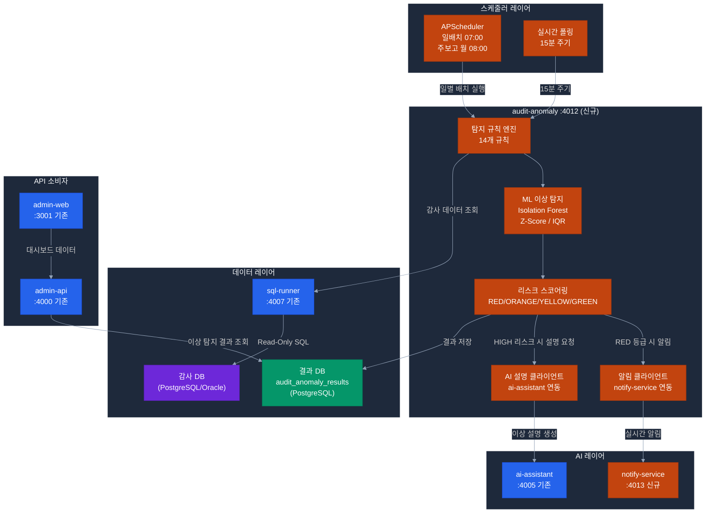

# audit-anomaly 서비스 설계 문서

> **서비스명**: audit-anomaly
> **포트**: 4012
> **기술**: Python 3.12 + FastAPI + scikit-learn + APScheduler
> **역할**: 행정 감사 이상 탐지 엔진 + 리스크 스코어링
> **우선순위**: P0 — POC 3 (감사 지능화) 핵심
> **작성일**: 2026-04-21

> **📌 참조**
> - 탐지 결과 저장: `packages/alli-audit` 엔티티 재사용 (admin-api 경유 POST)
> - 알림 발송: admin-api `notify 모듈` 호출 ([설계서](notify-service.md))
> - 관련 과제: [challenges/07-accounting-audit.md](../challenges/07-accounting-audit.md), [challenges/08-attendance-monitoring.md](../challenges/08-attendance-monitoring.md)
> - ⚠️ **과제 8 진행 시**: [🔴 P0-3 노조 협의 필수](../../challenges/decisions.md#-d8-05-미진행-시-영향--과제-8-2단계-연기-필수-사유)

---

## 1. 서비스 개요

### 1.1 목적

ERP 지출 내역, 법인카드 사용, 출장, 근태 데이터를 분석하여 **14개 감사 규칙**을 적용한 이상 패턴을 자동 탐지하고, AI 기반 리스크 스코어를 산출한다.  
매일 07:00 배치 실행 + 실시간 조회 API를 병행 제공하여 감사 담당자가 **사전 감사(Pre-Audit)** 를 수행할 수 있게 한다.

### 1.2 탐지 범위

| 카테고리 | 탐지 규칙 수 | 데이터 소스 |
|---------|:----------:|-----------|
| 회계 이상 (AUD-ACC) | 7개 | 지출결의, 법인카드, 출장 데이터 |
| 근태 이상 (AUD-ATT) | 3개 | 근태, 초과근무 데이터 |
| 예산 이상 (AUD-BDG) | 2개 | 예산 집행 현황 |
| 발주/계약 이상 (AUD-CTR) | 2개 | 발주, 계약 데이터 |

---

## 2. 시스템 구성도



### 2.1 내부 컴포넌트 구조

```
apps/audit-anomaly/
├── src/
│   ├── main.py                     # FastAPI 진입점
│   ├── scheduler.py                # APScheduler 설정
│   ├── rules/
│   │   ├── base_rule.py            # 탐지 규칙 베이스 클래스
│   │   ├── acc_rules.py            # 회계 이상 탐지 (AUD-ACC-01~07)
│   │   ├── att_rules.py            # 근태 이상 탐지 (AUD-ATT-01~03)
│   │   ├── bdg_rules.py            # 예산 이상 탐지 (AUD-BDG-01~02)
│   │   └── ctr_rules.py            # 계약 이상 탐지 (AUD-CTR-01~02)
│   ├── ml/
│   │   ├── isolation_forest.py     # Isolation Forest 이상 탐지
│   │   ├── statistical.py          # Z-Score, IQR 통계 방법
│   │   └── risk_scorer.py          # 리스크 스코어 계산
│   ├── clients/
│   │   ├── sql_runner_client.py    # sql-runner HTTP 클라이언트
│   │   ├── ai_explain_client.py    # ai-assistant 설명 요청
│   │   └── notify_client.py        # notify-service 알림 전송
│   ├── models/
│   │   ├── anomaly.py              # 이상 탐지 결과 모델
│   │   └── risk.py                 # 리스크 스코어 모델
│   ├── db/
│   │   ├── session.py              # SQLAlchemy 세션
│   │   ├── entities.py             # ORM 엔티티
│   │   └── migrations/             # Alembic 마이그레이션
│   └── routes/
│       ├── anomalies.py            # 이상 탐지 결과 API
│       ├── risk_scores.py          # 리스크 스코어 API
│       ├── dashboard.py            # 대시보드 집계 API
│       └── trigger.py              # 수동 실행 API (테스트용)
├── tests/
│   ├── test_acc_rules.py
│   ├── test_risk_scorer.py
│   └── fixtures/sample_data.py
├── Dockerfile
└── pyproject.toml
```

---

## 3. 감사 탐지 규칙 상세 (14종)

### 3.1 회계 이상 탐지 (AUD-ACC, 7종)

| 규칙 ID | 규칙명 | 탐지 조건 | 위험도 기본값 |
|---------|--------|---------|:----------:|
| AUD-ACC-01 | 분할 지출 탐지 | 동일인, 3일 내, 499,999원 이하, 3건 이상 | ORANGE |
| AUD-ACC-02 | 중복 지출 청구 | 동일 날짜, 동일 금액, 동일 직원 2건 이상 | RED |
| AUD-ACC-03 | 한도 초과 법인카드 사용 | 1회 사용 30만원 초과 (식대 허용 한도) | YELLOW |
| AUD-ACC-04 | 법인카드 출장지 불일치 | 출장 신청 도시 ≠ 법인카드 사용 도시 | ORANGE |
| AUD-ACC-05 | 비허용 업종 법인카드 | MCC 코드가 허용 업종 외 사용 | RED |
| AUD-ACC-06 | 반복 동일 금액 지출 | 동일 직원, 동일 금액, 월 3회 이상 | YELLOW |
| AUD-ACC-07 | 심야 고액 법인카드 | 22시 이후, 10만원 이상 사용 | ORANGE |

### 3.2 근태 이상 탐지 (AUD-ATT, 3종)

| 규칙 ID | 규칙명 | 탐지 조건 | 위험도 기본값 |
|---------|--------|---------|:----------:|
| AUD-ATT-01 | 연속 심야 초과근무 | 22시 이후 퇴근, 5일 연속 | YELLOW |
| AUD-ATT-02 | 초과근무 시간 이상 | 월 60시간 초과 (법정 한도) | ORANGE |
| AUD-ATT-03 | 유령 근무 의심 | 출근 기록 없이 초과근무 수당 청구 | RED |

### 3.3 예산 이상 탐지 (AUD-BDG, 2종)

| 규칙 ID | 규칙명 | 탐지 조건 | 위험도 기본값 |
|---------|--------|---------|:----------:|
| AUD-BDG-01 | 예산 잔액 급격 소진 | 연간 예산의 40% 이상을 12월에 집행 | ORANGE |
| AUD-BDG-02 | 부서 예산 초과 집행 | 예산 대비 집행률 110% 초과 | RED |

### 3.4 계약 이상 탐지 (AUD-CTR, 2종)

| 규칙 ID | 규칙명 | 탐지 조건 | 위험도 기본값 |
|---------|--------|---------|:----------:|
| AUD-CTR-01 | 수의계약 반복 | 동일 업체, 2천만원 미만 수의계약 월 3회 이상 | RED |
| AUD-CTR-02 | 검수 없는 계약 이행 | 계약 완료 후 30일 내 검수 기록 없음 | YELLOW |

---

## 4. 탐지 규칙 구현 코드

### 4.1 베이스 규칙 클래스

```python
# rules/base_rule.py

from abc import ABC, abstractmethod
from dataclasses import dataclass
from enum import Enum
from typing import Any

class RiskLevel(str, Enum):
    RED = "RED"
    ORANGE = "ORANGE"
    YELLOW = "YELLOW"
    GREEN = "GREEN"

@dataclass
class AnomalyResult:
    rule_id: str
    rule_name: str
    emp_id: str
    dept_cd: str
    risk_level: RiskLevel
    risk_score: float           # 0.0 ~ 1.0
    evidence: dict[str, Any]    # 탐지 근거 데이터
    detected_at: str
    tenant_id: str

class BaseAuditRule(ABC):
    """모든 감사 탐지 규칙의 베이스 클래스"""
    
    rule_id: str
    rule_name: str
    default_risk_level: RiskLevel
    
    @abstractmethod
    async def detect(
        self,
        data: list[dict],
        threshold: dict,
        tenant_id: str,
    ) -> list[AnomalyResult]:
        """이상 패턴 탐지 실행. 탐지된 결과 목록 반환."""
        ...
    
    def calculate_risk_score(
        self,
        value: float,
        threshold_value: float,
        risk_level: RiskLevel,
    ) -> float:
        """
        규칙 위반 정도에 따른 리스크 스코어 계산.
        0.0 (정상) ~ 1.0 (최고 위험)
        """
        ratio = value / threshold_value if threshold_value > 0 else 1.0
        base_scores = {
            RiskLevel.RED: 0.8,
            RiskLevel.ORANGE: 0.5,
            RiskLevel.YELLOW: 0.3,
            RiskLevel.GREEN: 0.1,
        }
        base = base_scores[risk_level]
        return min(base + (ratio - 1.0) * 0.1, 1.0)
```

### 4.2 회계 이상 탐지 구현 (AUD-ACC-01)

```python
# rules/acc_rules.py

class SplitPaymentRule(BaseAuditRule):
    """
    AUD-ACC-01: 분할 지출 탐지
    3일 내 동일인 499,999원 이하 지출 3건 이상 = 의도적 분할
    """
    rule_id = "AUD-ACC-01"
    rule_name = "분할 지출 탐지"
    default_risk_level = RiskLevel.ORANGE
    
    async def detect(self, data, threshold, tenant_id) -> list[AnomalyResult]:
        results = []
        
        # sql-runner에서 분할 지출 의심 데이터 조회
        split_data = await self.sql_client.run_audit_query(
            "split_payment_detection",
            params={
                "start_date": threshold.get("start_date"),
                "end_date": threshold.get("end_date"),
            },
            tenant_id=tenant_id,
        )
        
        for row in split_data:
            if row["rolling_3day_count"] >= 3:
                # 리스크 스코어 계산
                score = self.calculate_risk_score(
                    value=row["rolling_3day_total"],
                    threshold_value=500000,
                    risk_level=self.default_risk_level,
                )
                
                results.append(AnomalyResult(
                    rule_id=self.rule_id,
                    rule_name=self.rule_name,
                    emp_id=row["emp_id"],
                    dept_cd=row["dept_cd"],
                    risk_level=self.default_risk_level,
                    risk_score=score,
                    evidence={
                        "rolling_3day_count": row["rolling_3day_count"],
                        "rolling_3day_total": row["rolling_3day_total"],
                        "avg_amount": row["avg_amount"],
                        "detection_window": "3일 이내",
                        "threshold": "건당 499,999원 이하 3건 이상",
                    },
                    detected_at=datetime.utcnow().isoformat(),
                    tenant_id=tenant_id,
                ))
        
        return results
```

### 4.3 ML 기반 이상 탐지 (Isolation Forest)

```python
# ml/isolation_forest.py

from sklearn.ensemble import IsolationForest
import numpy as np

class IsolationForestDetector:
    """
    Isolation Forest 기반 다변량 이상 탐지.
    부서별 지출 패턴에서 통계적 이상치 탐지.
    """
    
    def __init__(self, contamination: float = 0.05):
        # contamination: 전체 데이터 중 이상치 비율 (5% 가정)
        self.model = IsolationForest(
            contamination=contamination,
            random_state=42,
            n_estimators=100,
        )
    
    def fit_and_predict(self, dept_data: list[dict]) -> list[dict]:
        """
        부서별 지출 데이터로 모델 학습 후 이상치 예측.
        
        Args:
            dept_data: 부서 지출 데이터 (월별 집계)
                [{"month": "2026-01", "total": 5000000, "count": 15, "avg": 333333}, ...]
        
        Returns:
            이상 여부 추가된 데이터 (anomaly_score: 낮을수록 이상)
        """
        if len(dept_data) < 6:
            return dept_data  # 데이터 부족 시 탐지 불가
        
        X = np.array([
            [d["total"], d["count"], d["avg"]]
            for d in dept_data
        ])
        
        scores = self.model.fit_predict(X)
        isolation_scores = self.model.score_samples(X)
        
        for i, row in enumerate(dept_data):
            row["is_anomaly"] = scores[i] == -1
            row["anomaly_score"] = float(-isolation_scores[i])  # 높을수록 이상
        
        return dept_data
```

### 4.4 리스크 스코어링 엔진

```python
# ml/risk_scorer.py

RISK_WEIGHTS = {
    "AUD-ACC-01": 0.15,   # 분할 지출 — 고의성 높음
    "AUD-ACC-02": 0.20,   # 중복 청구 — 직접 횡령 의심
    "AUD-ACC-03": 0.05,   # 한도 초과 — 경미
    "AUD-ACC-04": 0.12,   # 출장지 불일치 — 허위 출장 의심
    "AUD-ACC-05": 0.18,   # 비허용 업종 — 규정 위반 명확
    "AUD-ACC-06": 0.08,   # 반복 동일 금액
    "AUD-ACC-07": 0.10,   # 심야 고액 사용
    "AUD-ATT-01": 0.06,   # 연속 심야 근무
    "AUD-ATT-02": 0.08,   # 초과근무 한도
    "AUD-ATT-03": 0.20,   # 유령 근무 — 수당 부정
    "AUD-BDG-01": 0.10,   # 예산 급소진
    "AUD-BDG-02": 0.15,   # 예산 초과
    "AUD-CTR-01": 0.18,   # 수의계약 반복
    "AUD-CTR-02": 0.08,   # 검수 누락
}

RISK_LEVELS = {
    "RED":    (0.15, float("inf")),
    "ORANGE": (0.08, 0.15),
    "YELLOW": (0.03, 0.08),
    "GREEN":  (0.0,  0.03),
}

class RiskScorer:
    def compute_employee_risk(
        self,
        emp_id: str,
        dept_cd: str,
        anomalies: list[AnomalyResult],
        period: str,  # "2026-04"
    ) -> dict:
        """
        직원별 통합 리스크 스코어 계산.
        탐지된 이상 패턴의 가중 합산으로 최종 점수 산출.
        """
        total_score = 0.0
        
        for anomaly in anomalies:
            weight = RISK_WEIGHTS.get(anomaly.rule_id, 0.1)
            total_score += anomaly.risk_score * weight
        
        # 정규화 (0.0 ~ 1.0)
        final_score = min(total_score, 1.0)
        
        # 등급 분류
        risk_level = "GREEN"
        for level, (low, high) in RISK_LEVELS.items():
            if low <= final_score < high:
                risk_level = level
                break
        
        return {
            "emp_id": emp_id,
            "dept_cd": dept_cd,
            "period": period,
            "risk_score": round(final_score, 4),
            "risk_level": risk_level,
            "anomaly_count": len(anomalies),
            "anomaly_rules": [a.rule_id for a in anomalies],
        }
```

---

## 5. 배치 스케줄러

```python
# scheduler.py

from apscheduler.schedulers.asyncio import AsyncIOScheduler
from apscheduler.triggers.cron import CronTrigger

scheduler = AsyncIOScheduler(timezone="Asia/Seoul")

@scheduler.scheduled_job(
    CronTrigger(hour=7, minute=0),  # 매일 07:00
    id="daily_audit_batch"
)
async def run_daily_audit():
    """일별 감사 배치 실행"""
    yesterday = (date.today() - timedelta(days=1)).isoformat()
    
    # 1. 감사 데이터 수집 (sql-runner)
    audit_data = await sql_client.batch_analyze(target_date=yesterday)
    
    # 2. 14개 규칙 탐지
    all_anomalies = []
    for rule in ALL_RULES:
        anomalies = await rule.detect(
            data=audit_data,
            threshold=await load_thresholds(),
            tenant_id=current_tenant,
        )
        all_anomalies.extend(anomalies)
    
    # 3. 리스크 스코어링
    risk_scores = scorer.compute_all_risks(all_anomalies, period=yesterday)
    
    # 4. DB 저장
    await save_anomaly_results(all_anomalies)
    await save_risk_scores(risk_scores)
    
    # 5. RED 등급 알림 발송
    red_anomalies = [a for a in all_anomalies if a.risk_level == "RED"]
    if red_anomalies:
        await notify_client.send_audit_alert(red_anomalies)
    
    # 6. AI 설명 생성 (RED/ORANGE)
    high_risk = [a for a in all_anomalies if a.risk_level in ("RED", "ORANGE")]
    for anomaly in high_risk[:20]:  # 최대 20건
        explanation = await ai_explain_client.explain(anomaly)
        await update_anomaly_explanation(anomaly.rule_id, explanation)

@scheduler.scheduled_job(
    CronTrigger(day_of_week="mon", hour=8, minute=0),  # 매주 월요일 08:00
    id="weekly_risk_report"
)
async def run_weekly_risk_report():
    """주간 리스크 보고서 생성"""
    # 지난 주 리스크 현황 집계 → notify-service로 이메일 발송
    ...
```

---

## 6. API 엔드포인트

### 6.1 이상 탐지 결과 API

| Method | Path | 설명 |
|--------|------|------|
| GET | `/v1/anomalies` | 이상 탐지 목록 (필터: risk_level, rule_id, dept_cd, 기간) |
| GET | `/v1/anomalies/{anomaly_id}` | 이상 탐지 상세 (AI 설명 포함) |
| PATCH | `/v1/anomalies/{anomaly_id}/status` | 처리 상태 업데이트 (REVIEWED / CLOSED) |
| GET | `/v1/risk-scores` | 부서별 리스크 스코어 목록 |
| GET | `/v1/dashboard` | 대시보드 KPI (오늘 탐지 건수, RED 건수 등) |
| POST | `/v1/trigger/daily` | 수동 일배치 실행 (테스트용) |
| GET | `/health` | 헬스체크 |

### 6.2 대시보드 KPI 응답 예시

```json
{
  "today": {
    "total_anomalies": 12,
    "red_count": 3,
    "orange_count": 5,
    "yellow_count": 4,
    "pending_review": 10
  },
  "this_month": {
    "total_anomalies": 87,
    "resolved_rate": 68.5,
    "avg_risk_score": 0.094,
    "top_rules": [
      {"rule_id": "AUD-ACC-01", "count": 23, "name": "분할 지출"},
      {"rule_id": "AUD-ACC-04", "count": 18, "name": "출장지 불일치"}
    ]
  },
  "dept_risk_heatmap": [
    {"dept_cd": "DEPT-010", "dept_name": "예산기획팀", "risk_level": "ORANGE", "score": 0.121},
    {"dept_cd": "DEPT-020", "dept_name": "총무팀", "risk_level": "RED", "score": 0.183}
  ]
}
```

---

## 7. DB 스키마

```sql
-- 이상 탐지 결과 테이블
CREATE TABLE audit_anomaly_results (
    id              UUID PRIMARY KEY DEFAULT gen_random_uuid(),
    rule_id         VARCHAR(20) NOT NULL,   -- AUD-ACC-01 등
    rule_name       VARCHAR(100) NOT NULL,
    emp_id          VARCHAR(50) NOT NULL,
    dept_cd         VARCHAR(50) NOT NULL,
    risk_level      VARCHAR(10) NOT NULL,   -- RED/ORANGE/YELLOW/GREEN
    risk_score      DECIMAL(5,4) NOT NULL,  -- 0.0000 ~ 1.0000
    evidence        JSONB NOT NULL,         -- 탐지 근거 데이터
    ai_explanation  TEXT,                   -- AI 생성 설명 (비동기 채워짐)
    status          VARCHAR(20) DEFAULT 'OPEN', -- OPEN/REVIEWED/CLOSED
    reviewer_emp_cd VARCHAR(50),
    reviewer_comment TEXT,
    detected_at     TIMESTAMPTZ DEFAULT NOW(),
    reviewed_at     TIMESTAMPTZ,
    tenant_id       VARCHAR(50) NOT NULL,
    period          DATE NOT NULL           -- 탐지 기준일
);

-- 리스크 스코어 집계 테이블
CREATE TABLE audit_risk_scores (
    id              UUID PRIMARY KEY DEFAULT gen_random_uuid(),
    emp_id          VARCHAR(50) NOT NULL,
    dept_cd         VARCHAR(50) NOT NULL,
    period          VARCHAR(7) NOT NULL,    -- YYYY-MM
    risk_score      DECIMAL(5,4) NOT NULL,
    risk_level      VARCHAR(10) NOT NULL,
    anomaly_count   INT DEFAULT 0,
    anomaly_rules   TEXT[],                 -- 탐지된 규칙 ID 배열
    tenant_id       VARCHAR(50) NOT NULL,
    calculated_at   TIMESTAMPTZ DEFAULT NOW(),
    UNIQUE(emp_id, dept_cd, period, tenant_id)
);

-- 감사 기준값 테이블
CREATE TABLE audit_threshold (
    id              SERIAL PRIMARY KEY,
    rule_id         VARCHAR(20) UNIQUE NOT NULL,
    rule_name       VARCHAR(100) NOT NULL,
    threshold_value DECIMAL(15,4),
    threshold_unit  VARCHAR(20),            -- 원/건/일/시간
    risk_level      VARCHAR(10) NOT NULL,
    is_active       BOOLEAN DEFAULT TRUE,
    description     TEXT,
    updated_at      TIMESTAMPTZ DEFAULT NOW()
);

-- 인덱스
CREATE INDEX idx_anomaly_tenant_date ON audit_anomaly_results(tenant_id, detected_at);
CREATE INDEX idx_anomaly_risk_level  ON audit_anomaly_results(risk_level, status);
CREATE INDEX idx_risk_score_period   ON audit_risk_scores(tenant_id, period);
```

---

## 8. 외부 시스템 연동 명세

### 8.1 sql-runner 연동 (감사 데이터 조회)

| 항목 | 내용 |
|------|------|
| 연동 서비스 | sql-runner :4007 |
| 연동 방식 | HTTP REST API |
| 엔드포인트 | `POST /internal/audit/batch-analyze` |
| 인증 | 내부 서비스 JWT |
| 조회 데이터 | approval_history, corp_card_usage, business_trip, attendance, overtime |

### 8.2 ai-assistant 연동 (이상 설명 생성)

| 항목 | 내용 |
|------|------|
| 연동 서비스 | ai-assistant :4005 |
| 엔드포인트 | `POST /internal/audit/explain` |
| 요청 데이터 | AnomalyResult (rule_id, evidence, risk_level) |
| 응답 데이터 | explanation (자연어), regulation_refs (관련 규정), recommended_action |
| 처리 방식 | 비동기 (탐지 후 백그라운드 큐 처리) |

### 8.3 notify-service 연동 (RED 등급 알림)

| 항목 | 내용 |
|------|------|
| 연동 서비스 | notify-service :4013 |
| 엔드포인트 | `POST /v1/notify/audit-alert` |
| 트리거 조건 | risk_level = RED 탐지 시 즉시 |
| 알림 대상 | 감사 담당자 (tenant별 설정) |

---

## 9. 필요 데이터 및 문서 목록

### 9.1 외부로부터 수령 필요한 데이터

| # | 데이터 | 형태 | 제공 주체 | 용도 | 필수 |
|---|--------|------|---------|------|:---:|
| 1 | 감사 DB 읽기 전용 계정 | 계정정보 | DBA | sql-runner 연동 | P0 |
| 2 | 감사 원천 데이터 샘플 (1년치) | DB Export/CSV | 감사팀/DBA | 탐지 규칙 검증 | P0 |
| 3 | 감사 기준값 (임계치) 문서 | Excel/PDF | 감사팀 | audit_threshold 초기값 | P0 |
| 4 | 법인카드 허용 업종(MCC) 목록 | Excel | 총무팀 | AUD-ACC-05 기준 | P0 |
| 5 | 출장 허용 지역 및 일비 기준 | Excel/규정 | 총무팀 | AUD-ACC-04 기준 | P0 |
| 6 | 초과근무 한도 규정 | 근무규정 PDF | 인사팀 | AUD-ATT-02 기준 | P1 |
| 7 | 계약 유형별 검수 기한 규정 | 계약규정 PDF | 계약팀 | AUD-CTR-02 기준 | P1 |
| 8 | 과거 감사 적발 사례 | 익명화 Excel | 감사팀 | 탐지 규칙 검증 | P1 |
| 9 | 부서 코드 + 부서명 매핑 | Excel | 인사팀 | 부서 정보 표시 | P0 |
| 10 | 직원 코드 + 직급 매핑 | Excel | 인사팀 | 직원 정보 표시 | P0 |

### 9.2 내부 설정 데이터

```json
// config/thresholds.json (초기 기준값)
{
  "AUD-ACC-01": {
    "max_amount_per_tx": 499999,
    "min_count_in_3days": 3,
    "min_total_in_3days": 500000
  },
  "AUD-ACC-03": {
    "max_meal_single": 300000
  },
  "AUD-ACC-07": {
    "late_night_hour": 22,
    "min_amount": 100000
  },
  "AUD-ATT-02": {
    "monthly_overtime_limit_hours": 60
  }
}
```

---

## 10. 비기능 요건

| 항목 | 요건 | 비고 |
|------|------|------|
| **배치 완료 시간** | 1일치 데이터 ≤ 2시간 (07:00~09:00) | 10만 건 기준 |
| **실시간 API** | 조회 응답 ≤ 1초 (인덱스 최적화) | |
| **AI 설명 생성** | RED/ORANGE 최대 20건/일 (비동기) | 큐 처리 |
| **데이터 보존** | 이상 탐지 결과 3년 보존 | 감사 법적 요건 |
| **개인정보** | emp_id 이외 개인정보 최소화 | 실명 저장 금지 |
| **장애 격리** | 배치 실패 시 알림 발송, 다음 날 재실행 | |
| **정확도** | Precision ≥ 70%, Recall ≥ 80% | 샘플 데이터 검증 |

---

## 11. 개발 완료 기준

```
□ 14개 탐지 규칙 구현 완료
□ 샘플 데이터로 각 규칙별 탐지 동작 검증 (unit test)
□ 리스크 스코어링 엔진 동작 확인 (RED/ORANGE/YELLOW 분류)
□ APScheduler 일배치 07:00 실행 확인
□ sql-runner 연동 실제 쿼리 실행 확인
□ 이상 탐지 결과 DB 저장 확인
□ RED 등급 탐지 시 notify-service 알림 전송 확인
□ ai-assistant 이상 설명 생성 비동기 처리 확인
□ admin-api → audit-anomaly API 연동 확인
□ 대시보드 KPI API 응답 형식 확인
□ Docker Compose 기동 확인
□ /health 엔드포인트 정상 응답
```
